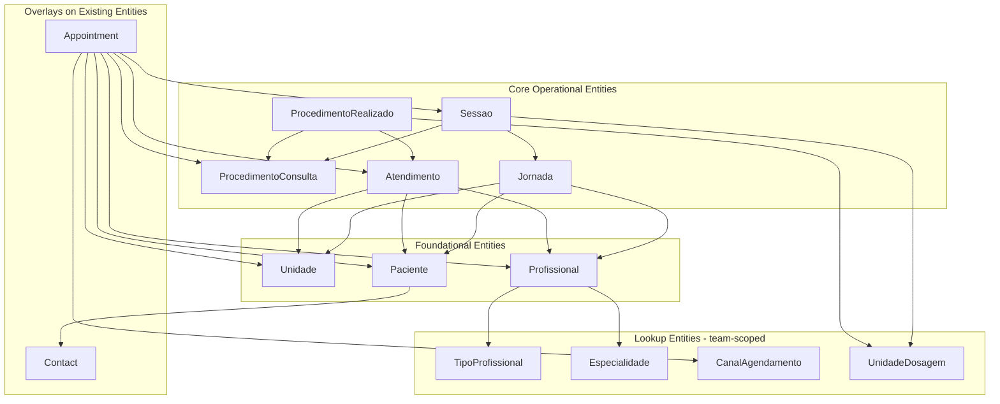

# FeatureClinica Fase 0 - Full Implementation

Base path: `components/crm/source/custom/Espo/Modules/FeatureClinica/`

## Architecture Overview



## Key Patterns to Follow

- **entityDefs**: Follow [Credential.json](components/crm/source/custom/Espo/Modules/FeatureCredential/Resources/metadata/entityDefs/Credential.json) structure
- **CascadeTeams hooks**: Follow [CascadeTeamsFromAccount.php](components/crm/source/custom/Espo/Modules/Chatwoot/Hooks/ChatwootAccountWebhook/CascadeTeamsFromAccount.php) (old style, `$order = 1`, `beforeSave(Entity, array)`)
- **Validation hooks**: Follow [ValidateStageFunnel.php](components/crm/source/custom/Espo/Modules/Global/Hooks/Opportunity/ValidateStageFunnel.php) (new style, `implements BeforeSave`)
- **Rebuild actions**: Follow [SeedCredentialTypes.php](components/crm/source/custom/Espo/Modules/FeatureCredential/Rebuild/SeedCredentialTypes.php) (`implements RebuildAction`)
- **Entity overlays**: Follow [Chatwoot/Contact.json](components/crm/source/custom/Espo/Modules/Chatwoot/Resources/metadata/entityDefs/Contact.json) (only add fields/links)
- **SeedRole edit**: Follow existing entries in [SeedRole.php](components/crm/source/custom/Espo/Modules/Global/Rebuild/SeedRole.php)

## Implementation Steps

### Step 1: Module Core (3 files)

- `Resources/module.json` -- order: 22, name: "FeatureClinica"
- `Resources/metadata/app/procedureTypes.json` -- registry with entityList + consumingEntities
- `Resources/metadata/app/rebuild.json` -- registers ValidateProcedureTypeRegistry + MigrateAppointmentStatus

### Step 2: Lookup Entities (4 entities, ~28 files)

Each gets: entityDefs, scopes, clientDefs, aclDefs, detail.json, list.json, pt_BR i18n, en_US i18n

- **TipoProfissional**: nome, codigo, requerCRM (bool), ativo. tab: false, hasTeams: true. ACL: admin CRUD, team read.
- **Especialidade**: nome, codigo, ativo. tab: false, hasTeams: true. Same ACL pattern.
- **CanalAgendamento**: nome, codigo, ativo. tab: false, hasTeams: true. Same ACL pattern.
- **UnidadeDosagem**: nome, sigla, ativo. tab: false, hasTeams: true. Same ACL pattern.

### Step 3: Foundational Entities (3 entities, ~22 files)

- **Unidade**: nome, cnpj (unique), endereco, telefone, email, responsavelId, ativa. tab: true, hasTeams: true. ACL: admin CRUD, team read.
- **Paciente**: contactId (required), name (stored, readOnly), foreign fields (contactName, emailAddress, phoneNumber), cpf (unique), dataNascimento, sexo. tab: true, stream: true, hasTeams: true. ACL: team CRUD, admin delete. Includes en_US + pt_BR i18n.
- **Profissional**: nome, tipoProfissionalId (required), crm, crmUf (enum Brazilian states), especialidades (linkMultiple), telefone, email, userId (optional), ativo. tab: true, hasTeams: true. ACL: admin CRUD, team read.
- **Contact overlay** ([Contact.json](components/crm/source/custom/Espo/Modules/FeatureClinica/Resources/metadata/entityDefs/Contact.json)): adds `pacientes` hasMany link. Plus pt_BR i18n.

### Step 4: Core Entities (5 entities, ~32 files)

- **ProcedimentoConsulta**: nome, codigo (unique), descricao, duracaoMin, unidadeId (optional), valorBase (currency), ativo. hasChildren links for appointments/sessoes/procedimentosRealizados. tab: true, hasTeams: true. ACL: admin CRUD, team read.
- **Jornada**: nome (varchar, required -- see Retroactive Corrections), pacienteId (required), unidadeId (required), profissionalId, convenioId (hidden), status enum, dataInicio, dataFim, descricao. cascadeDelete: sessoes. hasMany sessoes. tab: true, stream: true, hasTeams: true. nameAttribute: "nome".
- **Sessao**: jornadaId (required), sequencia, status enum, procedimento (linkParent), appointmentId, dosagemAplicada, unidadeDosagemId, unidadeId (required), observacao. tab: false, stream: true, hasTeams: true.
- **Atendimento**: pacienteId (required), unidadeId (required), profissionalId (required), jornadaId, appointmentId, dataHoraInicio (required), dataHoraFim, status enum, observacao. cascadeDelete: procedimentosRealizados. tab: true, stream: true, hasTeams: true.
- **ProcedimentoRealizado**: atendimentoId (required), procedimento (linkParent), sessaoId, quantidade, valorCobrado, dosagemAplicada, unidadeDosagemId, observacao. tab: false, stream: true, hasTeams: true.

### Step 5: Appointment Overlay (6 files)

Overlay files in FeatureClinica module that merge with Global's Appointment:

- **entityDefs/Appointment.json**: Override status enum (Scheduled/Confirmed/Realized/NoShow/Canceled/Rescheduled), set location required: false, add procedimento linkParent, add pacienteId/sessaoId/convenioId/atendimentoId/unidadeId/profissionalId/canalAgendamentoId links, duracaoPrevistaMin, observacao. Composite indexes.
- **scopes/Appointment.json**: Update activityStatusList/historyStatusList/completedStatusList/canceledStatusList to new English values.
- **clientDefs/Appointment.json**: Update filterList, sidePanels with new clinical fields.
- **layouts/Appointment/detail.json**: Add clinical fields to detail view.
- **layouts/Appointment/list.json**: Add procedimento column.
- **i18n/pt_BR/Appointment.json**: Portuguese labels for new fields + new status translations.
- **i18n/en_US/Appointment.json**: English labels for new fields + status values.

### Step 6: Hooks (9 PHP files)

- **Hooks/Sessao/CascadeTeamsFromJornada.php** (order 1) -- old style, copies teamsIds from Jornada
- **Hooks/ProcedimentoRealizado/CascadeTeamsFromAtendimento.php** (order 1) -- old style, copies teamsIds from Atendimento
- **Hooks/ProcedimentoRealizado/SnapshotDosagem.php** (order 9) -- copies dosagemAplicada/unidadeDosagemId from Sessao
- **Hooks/Paciente/SyncNameFromContact.php** (order 1) -- copies Contact.name to Paciente.name
- **Hooks/Paciente/ValidateUniqueCpf.php** (order 9) -- validates unique CPF before DB constraint
- **Hooks/Profissional/ValidateCRM.php** (order 9) -- validates CRM/CRM-UF required when TipoProfissional.requerCRM=true
- **Hooks/Appointment/SyncProfissionalToAssignedUsers.php** (order 5) -- bridges profissionalId to professionalsIds for calendar
- **Hooks/Appointment/CreateAtendimentoOnRealizado.php** (order 9) -- beforeSave, auto-creates Atendimento on status=Realized
- **Hooks/Appointment/UpdateSessaoStatus.php** (order 9) -- updates Sessao.status to Agendada when sessaoId is set

### Step 7: Rebuild Actions (2 PHP files)

- **Rebuild/ValidateProcedureTypeRegistry.php** -- reads procedureTypes.json, validates consuming entity entityLists match
- **Rebuild/MigrateAppointmentStatus.php** -- maps Planned->Scheduled, Held->Realized, Not Held->NoShow via SQL UPDATE

### Step 8: Service (1 PHP file)

- **Services/Jornada.php** -- extends Record, handles session generation logic (minimal for Fase 0)

### Step 9: SeedRole.php Edit

Add Paciente to [SeedRole.php](components/crm/source/custom/Espo/Modules/Global/Rebuild/SeedRole.php):

- `getTenantBaseConfig().data`: `'Paciente' => ['create' => 'yes', 'read' => 'team', 'edit' => 'team', 'delete' => 'own', 'stream' => 'team']`
- `getTenantBaseConfig().fieldData`: `'Paciente' => (object)[]`
- tenant-admin data override: `'Paciente' => ['create' => 'yes', 'read' => 'team', 'edit' => 'team', 'delete' => 'team', 'stream' => 'team']`

## Critical Notes

- **linkParent**: `entityList` goes on the FIELD definition, NOT on the belongsToParent link
- **hasChildren links**: use `"foreign": "procedimento"` (the belongsToParent link name), NO `foreignKey`/`foreignType`
- **foreign fields**: use `"link"` and `"field"` params (NOT legacy `"relation"`/`"foreign"` from ChatwootContact)
- **Convenio**: fields defined but HIDDEN from layouts (entity created in Fase 1)
- **Hook styles**: CascadeTeams hooks use old style (matching Chatwoot pattern); validation/business hooks use new style (`implements BeforeSave`)
- **teams field**: ALL entities get `teams` linkMultiple with `relationName: "entityTeam"` and `layoutRelationshipsDisabled: true`
- **hasTeams: true**: ALL entity scopes include this for team-based ACL filtering

## Retroactive Corrections (applied during Fase 1 implementation)

The following changes were identified during Fase 1 implementation as omissions or improvements to the original Fase 0 scope. They are documented here for traceability.

### Jornada `nome` Field

Added a `nome` field to Jornada (originally from the v1 spec, dropped in the v3 redesign, re-added as an improvement for display purposes):

- **entityDefs/Jornada.json**: Added `nome` (varchar, required, maxLength: 255, trim: true). Updated `textFilterFields` to include "nome".
- **clientDefs/Jornada.json**: Added `"nameAttribute": "nome"` so Jornada displays its name in links and lookups.
- **layouts/Jornada/detail.json**: Added `nome` to first row: `[{"name": "nome"}, {"name": "paciente"}]`.
- **layouts/Jornada/list.json**: Added `{"name": "nome", "link": true}` as the first (link) column; `paciente` moved to second column without link.
- **i18n/pt_BR/Jornada.json**: Added `"nome": "Nome"` field label.

### Relationship Layout Omissions

Three relationship layouts were omitted from the original Fase 0 scope but are required for the relationship panels to render correctly:

- **layouts/Jornada/relationships.json**: `["sessoes"]` (Jornada hasMany sessoes)
- **layouts/Atendimento/relationships.json**: `["procedimentosRealizados"]` (Atendimento cascadeDelete + hasMany procedimentosRealizados)
- **layouts/Paciente/relationships.json**: `["jornadas", "atendimentos", "appointments"]` (Paciente hasMany links from Fase 0)

### CascadeTeamsFromJornada.php Enhancement

Extended the existing CascadeTeams hook to also cascade `unidadeId` from Jornada to Sessao on create/update, ensuring Sessao inherits the unit context alongside teams:

```php
$unidadeId = $jornada->get('unidadeId');
if ($unidadeId && !$entity->get('unidadeId')) {
    $entity->set('unidadeId', $unidadeId);
}
```

### foreignName Additions on Jornada References

Added `foreignName: "nome"` to links pointing at Jornada so that related records display the Jornada name instead of the ID:

- **entityDefs/Atendimento.json**: `links.jornada` -- added `"foreignName": "nome"`
- **entityDefs/Sessao.json**: `links.jornada` -- added `"foreignName": "nome"`

---

## File Count Summary

- Module core: 3
- Lookup entities (4 x 8 files each): 32
- Foundational entities (3 x ~7 files + Contact overlay + i18n): ~24
- Core entities (5 x ~6 files each): ~30
- Appointment overlay: 7
- Hooks: 9
- Rebuild actions: 2
- Service: 1
- SeedRole edit: 1

**Total: ~74 files** (12 new entities + 2 overlays + hooks + rebuilds + service + SeedRole)
