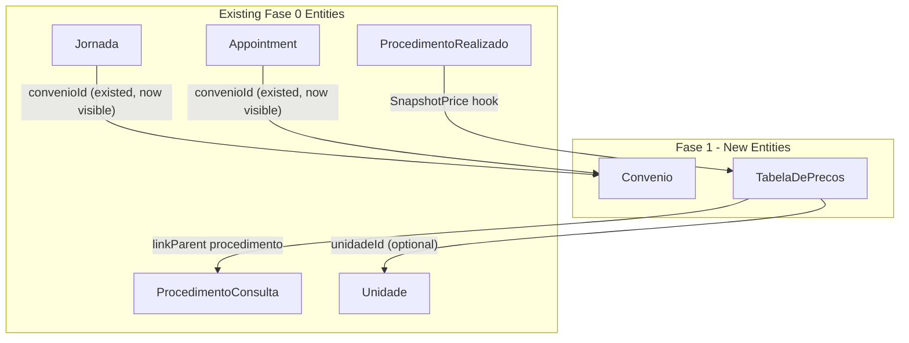

# FeatureClinica Fase 1 - Full Implementation

Base path: `components/crm/source/custom/Espo/Modules/FeatureClinica/`

## Scope (from v3.md forward references)

Fase 1 fulfills three forward references left by Fase 0:

- **Convenio entity** -- Jornada.convenioId and Appointment.convenioId point to this entity (fields defined in Fase 0 but hidden from layouts)
- **TabelaDePrecos entity** -- ProcedimentoRealizado.valorCobrado is populated from this (currency field exists but had no source)
- **Layout updates** -- show `convenio` in Jornada/Appointment layouts; Sessao dosage fields already shown in Fase 0

## Architecture




## Patterns to Follow

All patterns are identical to Fase 0 implementations:

- **entityDefs**: Follow [Unidade.json](components/crm/source/custom/Espo/Modules/FeatureClinica/Resources/metadata/entityDefs/Unidade.json) (similar admin entity with nome, cnpj, ativo)
- **Lookup scopes**: Follow [Unidade scopes](components/crm/source/custom/Espo/Modules/FeatureClinica/Resources/metadata/scopes/Unidade.json) (`tab: false` for TabelaDePrecos, `tab: false` for Convenio (accessed via admin panel, not main navigation))
- **Hooks**: Follow [SnapshotDosagem.php](components/crm/source/custom/Espo/Modules/FeatureClinica/Hooks/ProcedimentoRealizado/SnapshotDosagem.php) (old-style beforeSave)
- **Admin panel**: Follow existing entries in [adminForUserPanel.json](components/crm/source/custom/Espo/Modules/FeatureClinica/Resources/metadata/app/adminForUserPanel.json)
- **Controllers**: Extend `\Espo\Core\Templates\Controllers\Base`

---

## Step 1: Convenio Entity (10 new files)

**entityDefs/Convenio.json** -- Insurance/Health Plan:

- `nome` (varchar, required, maxLength: 255, trim: true)
- `cnpj` (varchar, maxLength: 18, trim: true)
- `telefone` (varchar, maxLength: 20, trim: true)
- `email` (varchar, maxLength: 255, trim: true)
- `ativo` (bool, default: true)
- Standard fields: createdAt, modifiedAt, createdBy, modifiedBy, teams
- Links: `jornadas` (hasMany Jornada, foreign: convenio), `appointments` (hasMany Appointment, foreign: convenio)
- Indexes: ativo
- Collection: orderBy: nome, asc; textFilterFields: ["nome", "cnpj"]

**scopes/Convenio.json**: entity: true, tab: false, stream: false, hasTeams: true, module: "FeatureClinica", type: "Base"

**clientDefs/Convenio.json**: controller: "controllers/record", iconClass: "fas fa-file-medical", nameAttribute: "nome", relationshipPanels for jornadas/appointments (create: false, select: false)

**aclDefs/Convenio.json**: create: "admin", read: "team", edit: "admin", delete: "admin", stream: false

**layouts**: detail.json, list.json, detailSmall.json -- fields: nome, cnpj, telefone, email, ativo

**i18n**: pt_BR (Convênio/Convênios) and en_US (Health Plan/Health Plans)

**Controllers/Convenio.php**: extends Base

---

## Step 2: TabelaDePrecos Entity (10 new files)

**entityDefs/TabelaDePrecos.json** -- Price Table:

- `procedimentoType` (varchar, maxLength: 100)
- `procedimentoId` (foreignId)
- `procedimento` (linkParent, entityList: ["ProcedimentoConsulta"])
- `valor` (currency, required) -- the price
- `vigenciaInicio` (date, required) -- validity start
- `vigenciaFim` (date, optional) -- validity end; null = currently active
- `unidade` (link to Unidade, optional) -- unit-specific price; null = tenant-wide
- `ativo` (bool, default: true)
- Standard fields + teams
- Links: procedimento (belongsToParent), unidade (belongsTo Unidade, foreignName: nome)
- Indexes: procedimento composite, unidadeId, ativo, vigenciaInicio
- Collection: orderBy: vigenciaInicio, desc

**scopes/TabelaDePrecos.json**: entity: true, tab: false, stream: false, hasTeams: true, module: "FeatureClinica", type: "Base"

**clientDefs/TabelaDePrecos.json**: controller: "controllers/record", iconClass: "fas fa-money-bill-wave", nameAttribute: "id", defaultSidePanelFieldLists

**aclDefs/TabelaDePrecos.json**: create: "admin", read: "team", edit: "admin", delete: "admin", stream: false

**layouts**: detail.json, list.json, detailSmall.json

**i18n**: pt_BR (Tabela de Preços/Tabelas de Preços) and en_US (Price Table/Price Tables)

**Controllers/TabelaDePrecos.php**: extends Base

---

## Step 3: Hooks (2 new files)

**Hooks/TabelaDePrecos/ExpirePreviousVigencia.php** (order 9, beforeSave):

- When entity is new: find existing active TabelaDePrecos with same procedimentoType + procedimentoId + unidadeId + vigenciaFim IS NULL
- Set vigenciaFim on old record to (new record's vigenciaInicio - 1 day)
- Ensures only one active price per procedure+unit combination

**Hooks/ProcedimentoRealizado/SnapshotPrice.php** (order 10, beforeSave):

- When entity is new or procedimentoId/procedimentoType changed
- If valorCobrado is already set, skip (respect manual override)
- Load Atendimento to get unidadeId
- Query active TabelaDePrecos: same procedure, ativo=true, vigenciaFim IS NULL or >= today
- Try unit-specific (matching unidadeId) first, fall back to tenant-wide (unidadeId IS NULL)
- Copy `valor` to `valorCobrado`

---

## Step 4: Edit Existing Files (11 edits)

### Layout Updates -- unhide convenio

**[layouts/Jornada/detail.json](components/crm/source/custom/Espo/Modules/FeatureClinica/Resources/layouts/Jornada/detail.json)**: Add `{"name": "convenio"}` to the profissional/status row:

```json
[{"name": "profissional"}, {"name": "status"}]
```

becomes:

```json
[{"name": "profissional"}, {"name": "convenio"}]
```

and move status to its own row or pair with another field.

**[layouts/Jornada/list.json](components/crm/source/custom/Espo/Modules/FeatureClinica/Resources/layouts/Jornada/list.json)**: Add `{"name": "convenio"}` column.

**[clientDefs/Appointment.json](components/crm/source/custom/Espo/Modules/FeatureClinica/Resources/metadata/clientDefs/Appointment.json)**: Add `{"name": "convenio"}` to all four sidePanels (detail, detailSmall, edit, editSmall).

### EntityDefs Updates -- add indexes and foreignName

**[entityDefs/Jornada.json](components/crm/source/custom/Espo/Modules/FeatureClinica/Resources/metadata/entityDefs/Jornada.json)**:

- Add `"foreignName": "nome"` to convenio link
- Add `"convenioId": {"columns": ["convenioId"]}` to indexes

**[entityDefs/Appointment.json](components/crm/source/custom/Espo/Modules/FeatureClinica/Resources/metadata/entityDefs/Appointment.json)**:

- Add `"foreignName": "nome"` to convenio link
- Add `"convenioId": {"columns": ["convenioId"]}` to indexes

**[entityDefs/Atendimento.json](components/crm/source/custom/Espo/Modules/FeatureClinica/Resources/metadata/entityDefs/Atendimento.json)**:

- Add `"foreignName": "nome"` to jornada link (requires Jornada `nome` field from Fase 0 retroactive corrections)

**[entityDefs/Sessao.json](components/crm/source/custom/Espo/Modules/FeatureClinica/Resources/metadata/entityDefs/Sessao.json)**:

- Add `"foreignName": "nome"` to jornada link (requires Jornada `nome` field from Fase 0 retroactive corrections)

**[entityDefs/ProcedimentoConsulta.json](components/crm/source/custom/Espo/Modules/FeatureClinica/Resources/metadata/entityDefs/ProcedimentoConsulta.json)**:

- Add `"tabelaDePrecos": {"type": "hasChildren", "entity": "TabelaDePrecos", "foreign": "procedimento"}` link

### Registry & Admin Panel

**[procedureTypes.json](components/crm/source/custom/Espo/Modules/FeatureClinica/Resources/metadata/app/procedureTypes.json)**: Add "TabelaDePrecos" to consumingEntities array.

**[adminForUserPanel.json](components/crm/source/custom/Espo/Modules/FeatureClinica/Resources/metadata/app/adminForUserPanel.json)**: Add Convenio (`#Convenio`) and TabelaDePrecos (`#Configurations/TabelaDePrecos`) entries.

**[i18n/pt_BR/Configurations.json](components/crm/source/custom/Espo/Modules/FeatureClinica/Resources/i18n/pt_BR/Configurations.json)**: Add Convenio and TabelaDePrecos labels/descriptions/keywords.

**[i18n/en_US/Configurations.json](components/crm/source/custom/Espo/Modules/FeatureClinica/Resources/i18n/en_US/Configurations.json)**: Add Convenio and TabelaDePrecos labels/descriptions/keywords.

### SeedRole

**[SeedRole.php](components/crm/source/custom/Espo/Modules/Global/Rebuild/SeedRole.php)**:

- `getTenantBaseConfig().data`: `'Convenio' => ['create' => 'no', 'read' => 'team', 'edit' => 'no', 'delete' => 'no']` and `'TabelaDePrecos' => ['create' => 'no', 'read' => 'team', 'edit' => 'no', 'delete' => 'no']`
- `getTenantBaseConfig().fieldData`: `'Convenio' => (object)[]` and `'TabelaDePrecos' => (object)[]`
- tenant-admin data: `'Convenio' => ['create' => 'yes', 'read' => 'team', 'edit' => 'team', 'delete' => 'team']` and `'TabelaDePrecos' => ['create' => 'yes', 'read' => 'team', 'edit' => 'team', 'delete' => 'team']`

---

## File Count Summary

- Convenio entity: 10 new files
- TabelaDePrecos entity: 10 new files
- Hooks: 2 new files
- Edits to existing files: 13 (includes Atendimento + Sessao foreignName additions)

**Total: 22 new files + 13 edits = 35 file operations**