# FeatureClinica Fase 2 - Catalogo Expansion

Base path: `components/crm/source/custom/Espo/Modules/FeatureClinica/`

## Scope

Fase 2 adds the remaining 4 procedure types (completing the catalog), plus ConvenioRegra (insurance coverage rules) and Programa/ProgramaItem (service packages). This unlocks the full polymorphic linkParent ecosystem — all consuming entities (Sessao, Appointment, ProcedimentoRealizado, TabelaDePrecos) can now point to any of the 5 procedure types.

## Architecture

```mermaid
graph TD
    subgraph fase2 [Fase 2 - New Entities]
        ProcInjetavel[ProcedimentoInjetavel]
        ProcImplante[ProcedimentoImplante]
        ProcEstetico[ProcedimentoEstetico]
        ProcAtivFisica[ProcedimentoAtividadeFisica]
        ConvenioRegra
        Programa
        ProgramaItem
    end

    subgraph existing [Existing Entities - Fase 0/1]
        ProcConsulta[ProcedimentoConsulta]
        Sessao
        Appointment
        ProcRealizado[ProcedimentoRealizado]
        TabelaDePrecos
        Convenio
        Unidade
        UnidadeDosagem
    end

    ProcInjetavel -->|unidadeDosagem link| UnidadeDosagem
    ProcInjetavel -->|unidadeId| Unidade
    ProcImplante -->|unidadeId| Unidade
    ProcEstetico -->|unidadeId| Unidade
    ProcAtivFisica -->|unidadeId| Unidade

    ConvenioRegra -->|convenioId| Convenio
    ConvenioRegra -->|"linkParent procedimento"| ProcConsulta
    ConvenioRegra -->|"linkParent procedimento"| ProcInjetavel
    ConvenioRegra -->|"linkParent procedimento"| ProcImplante
    ConvenioRegra -->|"linkParent procedimento"| ProcEstetico
    ConvenioRegra -->|"linkParent procedimento"| ProcAtivFisica

    Programa -->|unidadeId| Unidade
    ProgramaItem -->|programaId| Programa
    ProgramaItem -->|"linkParent procedimento"| ProcConsulta

    Sessao -.->|"entityList expanded"| ProcInjetavel
    Appointment -.->|"entityList expanded"| ProcInjetavel
    ProcRealizado -.->|"entityList expanded"| ProcInjetavel
    TabelaDePrecos -.->|"entityList expanded"| ProcInjetavel
```



## Patterns to Follow

All patterns are identical to Fase 0/1:

- **entityDefs**: Follow [ProcedimentoConsulta.json](components/crm/source/custom/Espo/Modules/FeatureClinica/Resources/metadata/entityDefs/ProcedimentoConsulta.json) (procedure entity with hasChildren links)
- **Catalog scopes**: Follow [UnidadeDosagem scopes](components/crm/source/custom/Espo/Modules/FeatureClinica/Resources/metadata/scopes/UnidadeDosagem.json) (`tab: false`, `hasTeams: true`). Note: ProcedimentoConsulta intentionally uses `tab: true` as the primary procedure type.
- **CascadeTeams hook**: Follow [CascadeTeamsFromJornada.php](components/crm/source/custom/Espo/Modules/FeatureClinica/Hooks/Sessao/CascadeTeamsFromJornada.php) (old style, order 1)
- **Admin panel**: Follow existing entries in [adminForUserPanel.json](components/crm/source/custom/Espo/Modules/FeatureClinica/Resources/metadata/app/adminForUserPanel.json)
- **Controllers**: Extend `\Espo\Core\Templates\Controllers\Base`
- **linkParent entityList**: Goes on the FIELD definition, NOT on the belongsToParent link
- **hasChildren links**: Use `"foreign": "procedimento"` (the belongsToParent link name), NO `foreignKey`/`foreignType`

---

## Step 1: ProcedimentoInjetavel Entity (11 new files)

**entityDefs/ProcedimentoInjetavel.json** -- Injectable procedures (Tirzepatida, Hybrius, Supra, etc.):

- `nome` (varchar, required, maxLength: 255, trim: true)
- `viaAdministracao` (enum, required) -- options: EV, IM, SC, Oral
- `dosagemPadrao` (float) -- suggested default dose
- `unidadeDosagem` (link to UnidadeDosagem entity) -- v3 adaptation: entity link replaces outdated enum
- `dosagemMinima` (float) -- minimum allowed dose
- `dosagemMaxima` (float) -- maximum allowed dose
- `requerPrescricao` (bool, default: true) -- requires active Prescricao
- `tempoAplicacaoMin` (int) -- estimated application time in minutes
- `protocolo` (text) -- clinical protocol description
- `unidade` (link to Unidade, optional) -- unit that offers this procedure
- `ativo` (bool, default: true)
- Standard fields: createdAt, modifiedAt, createdBy, modifiedBy, teams
- Links: unidade (belongsTo Unidade), unidadeDosagem (belongsTo UnidadeDosagem), appointments (hasChildren Appointment, foreign: procedimento), sessoes (hasChildren Sessao, foreign: procedimento), procedimentosRealizados (hasChildren ProcedimentoRealizado, foreign: procedimento), tabelaDePrecos (hasChildren TabelaDePrecos, foreign: procedimento), convenioRegras (hasChildren ConvenioRegra, foreign: procedimento), programaItens (hasChildren ProgramaItem, foreign: procedimento)
- Indexes: unidadeId, ativo, unidadeDosagemId
- Collection: orderBy: nome, asc; textFilterFields: ["nome"]

**NOTE:** `insumoId` link and `controlaEstoque` bool are **deferred to Fase 4** (Estoque). They will be added as edits to this entity in that fase.

**scopes/ProcedimentoInjetavel.json**: entity: true, tab: false, stream: false, hasTeams: true, module: "FeatureClinica", type: "Base"

**clientDefs/ProcedimentoInjetavel.json**: controller: "controllers/record", iconClass: "fas fa-syringe", nameAttribute: "nome", relationshipPanels for appointments/sessoes/procedimentosRealizados/tabelaDePrecos/convenioRegras/programaItens (create: false, select: false)

**aclDefs/ProcedimentoInjetavel.json**: create: "admin", read: "team", edit: "admin", delete: "admin", stream: false

**layouts**: detail.json (nome, viaAdministracao, dosagemPadrao, unidadeDosagem, dosagemMinima, dosagemMaxima, requerPrescricao, tempoAplicacaoMin, unidade, ativo, protocolo), list.json (nome, viaAdministracao, dosagemPadrao, unidadeDosagem, requerPrescricao, ativo), detailSmall.json (nome, viaAdministracao, ativo), relationships.json (all hasChildren panels)

**i18n**: pt_BR (Procedimento Injetável / Procedimentos Injetáveis), en_US (Injectable Procedure / Injectable Procedures). Field labels: viaAdministracao → Via de Administração / Administration Route, dosagemPadrao → Dosagem Padrão / Default Dosage, dosagemMinima → Dosagem Mínima / Minimum Dosage, dosagemMaxima → Dosagem Máxima / Maximum Dosage, requerPrescricao → Requer Prescrição / Requires Prescription, tempoAplicacaoMin → Tempo de Aplicação (min) / Application Time (min), protocolo → Protocolo / Protocol. Enum viaAdministracao options: EV → Endovenosa/Intravenous, IM → Intramuscular, SC → Subcutânea/Subcutaneous, Oral → Oral.

**Controllers/ProcedimentoInjetavel.php**: extends Base

---

## Step 2: ProcedimentoImplante Entity (11 new files)

**entityDefs/ProcedimentoImplante.json** -- Implant procedures (Testosterone, Estradiol, etc.):

- `nome` (varchar, required, maxLength: 255, trim: true)
- `substanciaAtiva` (varchar, required, maxLength: 255, trim: true) -- Testosterona, Estradiol, Oxandrolona...
- `forma` (enum, required) -- options: Silastico, Pellet, Outro
- `dosagemMg` (float, required) -- standard dosage in mg
- `validadeEstimadaDias` (int, required) -- days until renewal
- `requerSalaCirurgica` (bool, default: false)
- `requerCRM` (bool, default: true)
- `protocoloAplicacao` (text) -- application protocol
- `unidade` (link to Unidade, optional)
- `ativo` (bool, default: true)
- Standard fields: createdAt, modifiedAt, createdBy, modifiedBy, teams
- Links: unidade (belongsTo Unidade), appointments/sessoes/procedimentosRealizados/tabelaDePrecos/convenioRegras/programaItens (hasChildren, foreign: procedimento)
- Indexes: unidadeId, ativo
- Collection: orderBy: nome, asc; textFilterFields: ["nome", "substanciaAtiva"]

**NOTE:** `insumoId` link is **deferred to Fase 4**.

**scopes/ProcedimentoImplante.json**: entity: true, tab: false, stream: false, hasTeams: true, module: "FeatureClinica", type: "Base"

**clientDefs/ProcedimentoImplante.json**: controller: "controllers/record", iconClass: "fas fa-microchip", nameAttribute: "nome", relationshipPanels

**aclDefs/ProcedimentoImplante.json**: create: "admin", read: "team", edit: "admin", delete: "admin", stream: false

**layouts**: detail.json (nome, substanciaAtiva, forma, dosagemMg, validadeEstimadaDias, requerSalaCirurgica, requerCRM, unidade, ativo, protocoloAplicacao), list.json (nome, substanciaAtiva, forma, dosagemMg, validadeEstimadaDias, ativo), detailSmall.json (nome, substanciaAtiva, ativo), relationships.json

**i18n**: pt_BR (Procedimento Implante / Procedimentos Implante), en_US (Implant Procedure / Implant Procedures). Field labels: substanciaAtiva → Substância Ativa / Active Substance, forma → Forma / Form, dosagemMg → Dosagem (mg) / Dosage (mg), validadeEstimadaDias → Validade Estimada (dias) / Estimated Validity (days), requerSalaCirurgica → Requer Sala Cirúrgica / Requires Surgical Room, requerCRM → Requer CRM / Requires CRM, protocoloAplicacao → Protocolo de Aplicação / Application Protocol. Enum forma options: Silastico → Silástico/Silastic, Pellet → Pellet, Outro → Outro/Other.

**Controllers/ProcedimentoImplante.php**: extends Base

---

## Step 3: ProcedimentoEstetico Entity (11 new files)

**entityDefs/ProcedimentoEstetico.json** -- Aesthetic procedures (Drenagem, Eletrofit, Shape Space, etc.):

- `nome` (varchar, required, maxLength: 255, trim: true)
- `subtipo` (enum, required) -- options: Corporal, Facial, Capilar, Outro
- `duracaoMin` (int, required) -- duration in minutes
- `equipamentoNecessario` (varchar, maxLength: 255, trim: true) -- required equipment/room
- `requerAvaliacaoPrevia` (bool, default: false) -- requires prior consultation
- `maximoSessoesSemana` (int) -- weekly session limit
- `unidade` (link to Unidade, optional)
- `ativo` (bool, default: true)
- Standard fields: createdAt, modifiedAt, createdBy, modifiedBy, teams
- Links: unidade (belongsTo Unidade), appointments/sessoes/procedimentosRealizados/tabelaDePrecos/convenioRegras/programaItens (hasChildren, foreign: procedimento)
- Indexes: unidadeId, ativo
- Collection: orderBy: nome, asc; textFilterFields: ["nome"]

**scopes/ProcedimentoEstetico.json**: entity: true, tab: false, stream: false, hasTeams: true, module: "FeatureClinica", type: "Base"

**clientDefs/ProcedimentoEstetico.json**: controller: "controllers/record", iconClass: "fas fa-spa", nameAttribute: "nome", relationshipPanels

**aclDefs/ProcedimentoEstetico.json**: create: "admin", read: "team", edit: "admin", delete: "admin", stream: false

**layouts**: detail.json (nome, subtipo, duracaoMin, equipamentoNecessario, requerAvaliacaoPrevia, maximoSessoesSemana, unidade, ativo), list.json (nome, subtipo, duracaoMin, requerAvaliacaoPrevia, ativo), detailSmall.json (nome, subtipo, ativo), relationships.json

**i18n**: pt_BR (Procedimento Estético / Procedimentos Estéticos), en_US (Aesthetic Procedure / Aesthetic Procedures). Field labels: subtipo → Subtipo / Subtype, duracaoMin → Duração (min) / Duration (min), equipamentoNecessario → Equipamento Necessário / Required Equipment, requerAvaliacaoPrevia → Requer Avaliação Prévia / Requires Prior Evaluation, maximoSessoesSemana → Máximo Sessões/Semana / Max Sessions/Week. Enum subtipo: Corporal → Corporal/Body, Facial → Facial, Capilar → Capilar/Hair, Outro → Outro/Other.

**Controllers/ProcedimentoEstetico.php**: extends Base

---

## Step 4: ProcedimentoAtividadeFisica Entity (11 new files)

**entityDefs/ProcedimentoAtividadeFisica.json** -- Physical activity procedures (Academia, Pilates, Personal, etc.):

- `nome` (varchar, required, maxLength: 255, trim: true)
- `modalidade` (enum, required) -- options: Academia, Pilates, Personal, Funcional, Outro
- `duracaoMin` (int, required) -- duration in minutes
- `requerAvaliacaoFisica` (bool, default: false) -- requires physical evaluation
- `nivelIntensidade` (enum) -- options: Leve, Moderado, Intenso
- `unidade` (link to Unidade, optional)
- `ativo` (bool, default: true)
- Standard fields: createdAt, modifiedAt, createdBy, modifiedBy, teams
- Links: unidade (belongsTo Unidade), appointments/sessoes/procedimentosRealizados/tabelaDePrecos/convenioRegras/programaItens (hasChildren, foreign: procedimento)
- Indexes: unidadeId, ativo
- Collection: orderBy: nome, asc; textFilterFields: ["nome"]

**scopes/ProcedimentoAtividadeFisica.json**: entity: true, tab: false, stream: false, hasTeams: true, module: "FeatureClinica", type: "Base"

**clientDefs/ProcedimentoAtividadeFisica.json**: controller: "controllers/record", iconClass: "fas fa-dumbbell", nameAttribute: "nome", relationshipPanels

**aclDefs/ProcedimentoAtividadeFisica.json**: create: "admin", read: "team", edit: "admin", delete: "admin", stream: false

**layouts**: detail.json (nome, modalidade, duracaoMin, requerAvaliacaoFisica, nivelIntensidade, unidade, ativo), list.json (nome, modalidade, duracaoMin, nivelIntensidade, ativo), detailSmall.json (nome, modalidade, ativo), relationships.json

**i18n**: pt_BR (Procedimento Atividade Física / Procedimentos Atividade Física), en_US (Physical Activity Procedure / Physical Activity Procedures). Field labels: modalidade → Modalidade / Modality, duracaoMin → Duração (min) / Duration (min), requerAvaliacaoFisica → Requer Avaliação Física / Requires Physical Evaluation, nivelIntensidade → Nível de Intensidade / Intensity Level. Enum modalidade: Academia → Academia/Gym, Pilates, Personal, Funcional → Funcional/Functional, Outro → Outro/Other. Enum nivelIntensidade: Leve → Leve/Light, Moderado → Moderado/Moderate, Intenso → Intenso/Intense.

**Controllers/ProcedimentoAtividadeFisica.php**: extends Base

---

## Step 5: ConvenioRegra Entity (10 new files)

**entityDefs/ConvenioRegra.json** -- Insurance coverage rules per procedure:

- `convenio` (link, required) -- FK to Convenio
- `procedimentoType` (varchar, maxLength: 100)
- `procedimentoId` (foreignId)
- `procedimento` (linkParent) -- entityList: all 5 procedure types
- `cobertura` (enum, required) -- options: Total, Parcial, NaoCoberto
- `percentualCobertura` (float) -- coverage percentage when Parcial
- `valorFixo` (currency) -- fixed coverage amount (alternative to percentage)
- `limiteAnual` (int) -- max covered sessions per year
- `requerAutorizacao` (bool, default: false) -- requires prior authorization
- `vigenciaInicio` (date, required)
- `vigenciaFim` (date) -- null = currently active
- Standard fields: createdAt, modifiedAt, createdBy, modifiedBy, teams
- Links: convenio (belongsTo Convenio, foreignName: nome), procedimento (belongsToParent)
- Indexes: convenioId, procedimento composite (procedimentoType + procedimentoId), vigenciaInicio, cobertura
- Collection: orderBy: vigenciaInicio, desc; textFilterFields: []

**scopes/ConvenioRegra.json**: entity: true, tab: false, stream: false, hasTeams: true, module: "FeatureClinica", type: "Base"

**clientDefs/ConvenioRegra.json**: controller: "controllers/record", iconClass: "fas fa-balance-scale", nameAttribute: "id", defaultSidePanelFieldLists

**aclDefs/ConvenioRegra.json**: create: "admin", read: "team", edit: "admin", delete: "admin", stream: false

**layouts**: detail.json (convenio, procedimento, cobertura, percentualCobertura, valorFixo, limiteAnual, requerAutorizacao, vigenciaInicio, vigenciaFim), list.json (convenio, procedimento, cobertura, percentualCobertura, vigenciaInicio, vigenciaFim), detailSmall.json (convenio, procedimento, cobertura)

**i18n**: pt_BR (Regra de Convênio / Regras de Convênio), en_US (Health Plan Rule / Health Plan Rules). Field labels: cobertura → Cobertura / Coverage, percentualCobertura → Percentual de Cobertura / Coverage Percentage, valorFixo → Valor Fixo / Fixed Value, limiteAnual → Limite Anual / Annual Limit, requerAutorizacao → Requer Autorização / Requires Authorization, vigenciaInicio → Vigência Início / Validity Start, vigenciaFim → Vigência Fim / Validity End. Enum cobertura: Total → Total/Full, Parcial → Parcial/Partial, NaoCoberto → Não Coberto/Not Covered.

**Controllers/ConvenioRegra.php**: extends Base

---

## Step 6: Programa Entity (11 new files)

**entityDefs/Programa.json** -- Service package template:

- `nome` (varchar, required, maxLength: 255, trim: true)
- `descricao` (text) -- commercial description
- `precoTotal` (currency, required) -- package price
- `validadeDias` (int, required) -- consumption deadline in days
- `unidade` (link to Unidade, optional) -- unit-specific or tenant-wide (null)
- `ativo` (bool, default: true)
- Standard fields: createdAt, modifiedAt, createdBy, modifiedBy, teams
- Links: unidade (belongsTo Unidade, foreignName: nome), itens (hasMany ProgramaItem, foreign: programa, cascadeDelete: true)
- Indexes: unidadeId, ativo
- Collection: orderBy: nome, asc; textFilterFields: ["nome"]

**scopes/Programa.json**: entity: true, tab: false, stream: false, hasTeams: true, module: "FeatureClinica", type: "Base"

**clientDefs/Programa.json**: controller: "controllers/record", iconClass: "fas fa-box-open", nameAttribute: "nome", relationshipPanels for itens (create: true, select: false)

**aclDefs/Programa.json**: create: "admin", read: "team", edit: "admin", delete: "admin", stream: false

**layouts**: detail.json (nome, precoTotal, validadeDias, unidade, ativo, descricao), list.json (nome, precoTotal, validadeDias, unidade, ativo), detailSmall.json (nome, precoTotal, ativo), relationships.json (itens panel)

**i18n**: pt_BR (Programa / Programas), en_US (Program / Programs). Field labels: descricao → Descrição / Description, precoTotal → Preço Total / Total Price, validadeDias → Validade (dias) / Validity (days).

**Controllers/Programa.php**: extends Base

---

## Step 7: ProgramaItem Entity (10 new files)

**entityDefs/ProgramaItem.json** -- Items within a service package:

- `programa` (link, required) -- FK to Programa
- `procedimentoType` (varchar, maxLength: 100)
- `procedimentoId` (foreignId)
- `procedimento` (linkParent) -- entityList: all 5 procedure types
- `quantidade` (int, required) -- sessions included
- `ordem` (int) -- suggested sequence
- `observacao` (varchar, maxLength: 255, trim: true)
- Standard fields: createdAt, modifiedAt, createdBy, modifiedBy, teams
- Links: programa (belongsTo Programa, foreignName: nome), procedimento (belongsToParent)
- Indexes: programaId, procedimento composite, ordem
- Collection: orderBy: ordem, asc

**scopes/ProgramaItem.json**: entity: true, tab: false, stream: false, hasTeams: true, module: "FeatureClinica", type: "Base"

**clientDefs/ProgramaItem.json**: controller: "controllers/record", iconClass: "fas fa-list-ol", nameAttribute: "id"

**aclDefs/ProgramaItem.json**: create: "admin", read: "team", edit: "admin", delete: "admin", stream: false

**layouts**: detail.json (programa, procedimento, quantidade, ordem, observacao), list.json (procedimento, quantidade, ordem, observacao), detailSmall.json (procedimento, quantidade)

**i18n**: pt_BR (Item de Programa / Itens de Programa), en_US (Program Item / Program Items). Field labels: quantidade → Quantidade / Quantity, ordem → Ordem / Order, observacao → Observação / Note.

**Controllers/ProgramaItem.php**: extends Base

---

## Step 8: Hook (1 new file)

**Hooks/ProgramaItem/CascadeTeamsFromPrograma.php** (order 1, old style beforeSave):

- Copies `teamsIds` from parent Programa to ProgramaItem on create/update
- Follows exact pattern of [CascadeTeamsFromJornada.php](components/crm/source/custom/Espo/Modules/FeatureClinica/Hooks/Sessao/CascadeTeamsFromJornada.php)

---

## Step 9: Update Existing Files (11 edits)

### Registry

**[procedureTypes.json](components/crm/source/custom/Espo/Modules/FeatureClinica/Resources/metadata/app/procedureTypes.json)**:

Expand both arrays:

```json
{
    "entityList": [
        "ProcedimentoConsulta",
        "ProcedimentoInjetavel",
        "ProcedimentoImplante",
        "ProcedimentoEstetico",
        "ProcedimentoAtividadeFisica"
    ],
    "consumingEntities": [
        "Sessao",
        "Appointment",
        "ProcedimentoRealizado",
        "TabelaDePrecos",
        "ConvenioRegra",
        "ProgramaItem"
    ]
}
```

### Consuming Entity linkParent entityList Expansion

All 4 consuming entities need their `procedimento` field's `entityList` updated to include all 5 procedure types:

**[entityDefs/Sessao.json](components/crm/source/custom/Espo/Modules/FeatureClinica/Resources/metadata/entityDefs/Sessao.json)** -- `fields.procedimento.entityList`:

```json
["ProcedimentoConsulta", "ProcedimentoInjetavel", "ProcedimentoImplante", "ProcedimentoEstetico", "ProcedimentoAtividadeFisica"]
```

**[entityDefs/Appointment.json](components/crm/source/custom/Espo/Modules/FeatureClinica/Resources/metadata/entityDefs/Appointment.json)** -- `fields.procedimento.entityList`: same

**[entityDefs/ProcedimentoRealizado.json](components/crm/source/custom/Espo/Modules/FeatureClinica/Resources/metadata/entityDefs/ProcedimentoRealizado.json)** -- `fields.procedimento.entityList`: same

**[entityDefs/TabelaDePrecos.json](components/crm/source/custom/Espo/Modules/FeatureClinica/Resources/metadata/entityDefs/TabelaDePrecos.json)** -- `fields.procedimento.entityList`: same

### Existing Entity New Links

**[entityDefs/ProcedimentoConsulta.json](components/crm/source/custom/Espo/Modules/FeatureClinica/Resources/metadata/entityDefs/ProcedimentoConsulta.json)** -- add two new hasChildren links:

```json
"convenioRegras": {
    "type": "hasChildren",
    "entity": "ConvenioRegra",
    "foreign": "procedimento"
},
"programaItens": {
    "type": "hasChildren",
    "entity": "ProgramaItem",
    "foreign": "procedimento"
}
```

**[layouts/ProcedimentoConsulta/relationships.json](components/crm/source/custom/Espo/Modules/FeatureClinica/Resources/layouts/ProcedimentoConsulta/relationships.json)** -- append new panels:

```json
["tabelaDePrecos", "sessoes", "appointments", "procedimentosRealizados", "convenioRegras", "programaItens"]
```

**[entityDefs/Convenio.json](components/crm/source/custom/Espo/Modules/FeatureClinica/Resources/metadata/entityDefs/Convenio.json)** -- add hasMany link for rules:

```json
"convenioRegras": {
    "type": "hasMany",
    "entity": "ConvenioRegra",
    "foreign": "convenio"
}
```

### Admin Panel

**[adminForUserPanel.json](components/crm/source/custom/Espo/Modules/FeatureClinica/Resources/metadata/app/adminForUserPanel.json)** -- add entries to clinica section:

```json
{
    "url": "#ProcedimentoInjetavel",
    "label": "Procedimentos Injetáveis",
    "iconClass": "fas fa-syringe",
    "description": "procedimentosInjetavel",
    "roles": ["tenant", "tenant-admin"]
},
{
    "url": "#ProcedimentoImplante",
    "label": "Procedimentos Implante",
    "iconClass": "fas fa-microchip",
    "description": "procedimentosImplante",
    "roles": ["tenant", "tenant-admin"]
},
{
    "url": "#ProcedimentoEstetico",
    "label": "Procedimentos Estéticos",
    "iconClass": "fas fa-spa",
    "description": "procedimentosEstetico",
    "roles": ["tenant", "tenant-admin"]
},
{
    "url": "#ProcedimentoAtividadeFisica",
    "label": "Procedimentos Ativ. Física",
    "iconClass": "fas fa-dumbbell",
    "description": "procedimentosAtividadeFisica",
    "roles": ["tenant", "tenant-admin"]
},
{
    "url": "#Configurations/ConvenioRegra",
    "label": "Regras de Convênio",
    "iconClass": "fas fa-balance-scale",
    "description": "convenioRegras",
    "roles": ["tenant", "tenant-admin"]
},
{
    "url": "#Configurations/Programa",
    "label": "Programas",
    "iconClass": "fas fa-box-open",
    "description": "programas",
    "roles": ["tenant", "tenant-admin"]
}
```

### Configurations i18n

**[i18n/pt_BR/Configurations.json](components/crm/source/custom/Espo/Modules/FeatureClinica/Resources/i18n/pt_BR/Configurations.json)** -- add labels, descriptions, keywords for new entities:

- labels: "Procedimentos Injetáveis", "Procedimentos Implante", "Procedimentos Estéticos", "Procedimentos Ativ. Física", "Regras de Convênio", "Programas"
- descriptions: procedimentosInjetavel → "Gerenciar procedimentos injetáveis e protocolos", procedimentosImplante → "Gerenciar procedimentos de implante", procedimentosEstetico → "Gerenciar procedimentos estéticos", procedimentosAtividadeFisica → "Gerenciar procedimentos de atividade física", convenioRegras → "Gerenciar regras de cobertura por convênio", programas → "Gerenciar programas e pacotes de serviços"
- keywords: appropriate search terms for each

**[i18n/en_US/Configurations.json](components/crm/source/custom/Espo/Modules/FeatureClinica/Resources/i18n/en_US/Configurations.json)** -- equivalent English entries

### SeedRole

**[SeedRole.php](components/crm/source/custom/Espo/Modules/Global/Rebuild/SeedRole.php)** -- add all 7 new entities:

`getTenantBaseConfig().data`:

```php
'ProcedimentoInjetavel' => ['create' => 'no', 'read' => 'team', 'edit' => 'no', 'delete' => 'no'],
'ProcedimentoImplante' => ['create' => 'no', 'read' => 'team', 'edit' => 'no', 'delete' => 'no'],
'ProcedimentoEstetico' => ['create' => 'no', 'read' => 'team', 'edit' => 'no', 'delete' => 'no'],
'ProcedimentoAtividadeFisica' => ['create' => 'no', 'read' => 'team', 'edit' => 'no', 'delete' => 'no'],
'ConvenioRegra' => ['create' => 'no', 'read' => 'team', 'edit' => 'no', 'delete' => 'no'],
'Programa' => ['create' => 'no', 'read' => 'team', 'edit' => 'no', 'delete' => 'no'],
'ProgramaItem' => ['create' => 'no', 'read' => 'team', 'edit' => 'no', 'delete' => 'no'],
```

`getTenantBaseConfig().fieldData`:

```php
'ProcedimentoInjetavel' => (object)[],
'ProcedimentoImplante' => (object)[],
'ProcedimentoEstetico' => (object)[],
'ProcedimentoAtividadeFisica' => (object)[],
'ConvenioRegra' => (object)[],
'Programa' => (object)[],
'ProgramaItem' => (object)[],
```

tenant-admin data overrides:

```php
'ProcedimentoInjetavel' => ['create' => 'yes', 'read' => 'team', 'edit' => 'team', 'delete' => 'team'],
'ProcedimentoImplante' => ['create' => 'yes', 'read' => 'team', 'edit' => 'team', 'delete' => 'team'],
'ProcedimentoEstetico' => ['create' => 'yes', 'read' => 'team', 'edit' => 'team', 'delete' => 'team'],
'ProcedimentoAtividadeFisica' => ['create' => 'yes', 'read' => 'team', 'edit' => 'team', 'delete' => 'team'],
'ConvenioRegra' => ['create' => 'yes', 'read' => 'team', 'edit' => 'team', 'delete' => 'team'],
'Programa' => ['create' => 'yes', 'read' => 'team', 'edit' => 'team', 'delete' => 'team'],
'ProgramaItem' => ['create' => 'yes', 'read' => 'team', 'edit' => 'team', 'delete' => 'team'],
```

### SeedSidenavConfig

No changes. All Fase 2 entities are catalog/admin entities, not operational nav items.

---

## v3 Design Adaptations from Outdated SPEC

1. **UnidadeDosagem entity link** replaces `unidadeDosagem` enum on ProcedimentoInjetavel (Decision 16 — entity-backed lookups)
2. **No ProcedimentoBase files** (Decision 5) — naming convention only, each entity is fully independent
3. **insumoId / controlaEstoque deferred to Fase 4** — ProcedimentoInjetavel and ProcedimentoImplante are created without stock links first
4. **Team-based ACL** — all entities get `hasTeams: true`, not enum-based permissions
5. **linkParent entityList on field, not link** — confirmed pattern from Fase 0
6. **hasChildren with foreign, no foreignKey/foreignType** — confirmed pattern from ProcedimentoConsulta
7. **Convenio.tipo enum removed** — v3 Convenio (Fase 1) simplified, no tipo field
8. **Profissional.unidades linkMultiple removed** — v3 uses team-based scoping, not explicit linkMultiple to Unidade
9. **TabelaDePrecos redesigned** — v3 version (Fase 1) uses unidadeId instead of profissionalId, no modalidade/convenioId

---

## File Count Summary

- ProcedimentoInjetavel: 11 new files (entityDefs, scopes, clientDefs, aclDefs, 4 layouts, 2 i18n, Controller)
- ProcedimentoImplante: 11 new files
- ProcedimentoEstetico: 11 new files
- ProcedimentoAtividadeFisica: 11 new files
- ConvenioRegra: 10 new files (no relationships layout)
- Programa: 11 new files
- ProgramaItem: 10 new files (no relationships layout)
- Hook: 1 new file
- Edits: 12 (procedureTypes, 4 consuming entityDefs, ProcedimentoConsulta entityDefs, ProcedimentoConsulta relationships layout, Convenio entityDefs, SeedRole, adminForUserPanel, 2 Configurations i18n)

**Total: 76 new files + 12 edits = 88 file operations**
