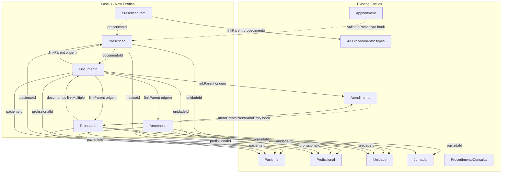

# FeatureClinica Fase 3 - Clínico

Base path: `components/crm/source/custom/Espo/Modules/FeatureClinica/`

## Scope

Fase 3 adds the clinical record layer: prescriptions (Prescricao + PrescricaoItem), patient questionnaires (Anamnese), clinical records (Prontuario), and file repository (Documento). These entities exist independently of the scheduling/appointment cycle and serve as the clinical backbone of patient care tracking.

## Architecture



## Patterns to Follow

- **entityDefs**: Follow [Convenio.json](components/crm/source/custom/Espo/Modules/FeatureClinica/Resources/metadata/entityDefs/Convenio.json) (clinical entity with multiple links)
- **Clinical scopes**: `tab: false` for PrescricaoItem; `tab: true` for Prontuario (frequently accessed); `tab: false` for others (accessed via Paciente detail or admin)
- **CascadeTeams hook**: Follow [CascadeTeamsFromJornada.php](components/crm/source/custom/Espo/Modules/FeatureClinica/Hooks/Sessao/CascadeTeamsFromJornada.php) (old style, order 1)
- **Validation hooks**: Follow [ValidateCRM.php](components/crm/source/custom/Espo/Modules/FeatureClinica/Hooks/Profissional/ValidateCRM.php) (new style, `implements BeforeSave`)
- **linkParent entityList on field**, hasChildren with `"foreign"` — confirmed v3 patterns

---

## Step 1: Prescricao Entity (11 new files)

**entityDefs/Prescricao.json** -- Medical prescription:

- `paciente` (link, required) -- FK to Paciente
- `medico` (link, required) -- FK to Profissional (must have CRM)
- `unidade` (link, required) -- FK to Unidade
- `dataEmissao` (date, required) -- issue date
- `dataValidade` (date, required) -- expiry date
- `status` (enum, required) -- options: Ativa, Expirada, Cancelada. Default: Ativa
- `tipo` (enum, required) -- options: Simples, Especial, ControleEspecial
- `observacoes` (text) -- general instructions
- `documento` (link) -- FK to Documento (scanned prescription)
- Standard fields: createdAt, modifiedAt, createdBy, modifiedBy, teams
- Links: paciente (belongsTo Paciente), medico (belongsTo Profissional, foreignName: nome), unidade (belongsTo Unidade, foreignName: nome), documento (belongsTo Documento), itens (hasMany PrescricaoItem, foreign: prescricao, cascadeDelete: true)
- Indexes: pacienteId, medicoId, unidadeId, status, dataValidade
- Collection: orderBy: dataEmissao, desc; textFilterFields: []

**scopes/Prescricao.json**: entity: true, tab: false, stream: true, hasTeams: true, module: "FeatureClinica", type: "Base"

**clientDefs/Prescricao.json**: controller: "controllers/record", iconClass: "fas fa-prescription", nameAttribute: "id", relationshipPanels for itens (create: true, select: false), filterList with statusFilter

**aclDefs/Prescricao.json**: create: "yes", read: "team", edit: "team", delete: "own", stream: "team"

**layouts**: detail.json (paciente, medico, unidade, dataEmissao, dataValidade, status, tipo, documento, observacoes), list.json (paciente, medico, dataEmissao, dataValidade, status, tipo), detailSmall.json (paciente, status, tipo), relationships.json (itens panel)

**i18n**: pt_BR (Prescrição / Prescrições), en_US (Prescription / Prescriptions). Field labels: medico → Médico Prescritor / Prescribing Doctor, dataEmissao → Data de Emissão / Issue Date, dataValidade → Data de Validade / Expiry Date, status → Status, tipo → Tipo / Type, observacoes → Observações / Notes, documento → Documento / Document. Enum status: Ativa → Ativa/Active, Expirada → Expirada/Expired, Cancelada → Cancelada/Canceled. Enum tipo: Simples → Simples/Simple, Especial → Especial/Special, ControleEspecial → Controle Especial/Controlled.

**Controllers/Prescricao.php**: extends Base

---

## Step 2: PrescricaoItem Entity (10 new files)

**entityDefs/PrescricaoItem.json** -- Individual prescribed item:

- `prescricao` (link, required) -- FK to Prescricao
- `procedimentoType` (varchar, maxLength: 100)
- `procedimentoId` (foreignId)
- `procedimento` (linkParent) -- entityList: all 5 procedure types
- `dosagem` (varchar, maxLength: 100, trim: true) -- e.g. "5mg, 2x por semana"
- `quantidade` (int, required)
- `instrucoes` (text) -- administration instructions
- Standard fields: createdAt, modifiedAt, createdBy, modifiedBy, teams
- Links: prescricao (belongsTo Prescricao), procedimento (belongsToParent)
- Indexes: prescricaoId, procedimento composite
- Collection: orderBy: createdAt, asc

**NOTE:** `insumoId` link is structurally defined here (foreignId field) but has no validation or consuming logic until Fase 4. The field exists so prescriptions can reference insumos when they become available.

**scopes/PrescricaoItem.json**: entity: true, tab: false, stream: false, hasTeams: true, module: "FeatureClinica", type: "Base"

**clientDefs/PrescricaoItem.json**: controller: "controllers/record", iconClass: "fas fa-pills", nameAttribute: "id"

**aclDefs/PrescricaoItem.json**: create: "yes", read: "team", edit: "team", delete: "own", stream: false

**layouts**: detail.json (prescricao, procedimento, dosagem, quantidade, instrucoes), list.json (procedimento, dosagem, quantidade), detailSmall.json (procedimento, dosagem, quantidade)

**i18n**: pt_BR (Item de Prescrição / Itens de Prescrição), en_US (Prescription Item / Prescription Items). Field labels: dosagem → Dosagem / Dosage, quantidade → Quantidade / Quantity, instrucoes → Instruções / Instructions.

**Controllers/PrescricaoItem.php**: extends Base

---

## Step 3: Anamnese Entity (10 new files)

**entityDefs/Anamnese.json** -- Patient intake questionnaire:

- `paciente` (link, required) -- FK to Paciente
- `profissional` (link, required) -- FK to Profissional (who collected)
- `unidade` (link, required) -- FK to Unidade
- `dataColeta` (date, required) -- collection date
- `versao` (int, required, default: 1) -- version control (1, 2, 3...)
- `queixaPrincipal` (text) -- chief complaint
- `historicoDoenças` (text) -- pre-existing conditions
- `medicamentosEmUso` (text) -- current medications
- `alergias` (text) -- known allergies
- `historicoFamiliar` (text) -- family history
- `habitosAlimentares` (text) -- dietary habits
- `nivelAtividadeFisica` (enum) -- options: Sedentario, PoucoAtivo, Ativo, MuitoAtivo
- `objetivos` (text) -- patient goals
- `observacoes` (text) -- general notes
- `jornada` (link) -- FK to Jornada (originating journey, optional)
- Standard fields: createdAt, modifiedAt, createdBy, modifiedBy, teams
- Links: paciente (belongsTo Paciente), profissional (belongsTo Profissional, foreignName: nome), unidade (belongsTo Unidade, foreignName: nome), jornada (belongsTo Jornada)
- Indexes: pacienteId, profissionalId, unidadeId, jornadaId, dataColeta
- Collection: orderBy: dataColeta, desc; textFilterFields: ["queixaPrincipal"]

**scopes/Anamnese.json**: entity: true, tab: false, stream: true, hasTeams: true, module: "FeatureClinica", type: "Base"

**clientDefs/Anamnese.json**: controller: "controllers/record", iconClass: "fas fa-clipboard-list", nameAttribute: "id"

**aclDefs/Anamnese.json**: create: "yes", read: "team", edit: "team", delete: "own", stream: "team"

**layouts**: detail.json (paciente, profissional, unidade, dataColeta, versao, jornada, queixaPrincipal, historicoDoenças, medicamentosEmUso, alergias, historicoFamiliar, habitosAlimentares, nivelAtividadeFisica, objetivos, observacoes), list.json (paciente, profissional, dataColeta, versao, queixaPrincipal), detailSmall.json (paciente, dataColeta, versao)

**i18n**: pt_BR (Anamnese / Anamneses), en_US (Anamnesis / Anamneses). Field labels: dataColeta → Data da Coleta / Collection Date, versao → Versão / Version, queixaPrincipal → Queixa Principal / Chief Complaint, historicoDoenças → Histórico de Doenças / Disease History, medicamentosEmUso → Medicamentos em Uso / Current Medications, alergias → Alergias / Allergies, historicoFamiliar → Histórico Familiar / Family History, habitosAlimentares → Hábitos Alimentares / Dietary Habits, nivelAtividadeFisica → Nível de Atividade Física / Physical Activity Level, objetivos → Objetivos / Goals, observacoes → Observações / Notes. Enum nivelAtividadeFisica: Sedentario → Sedentário/Sedentary, PoucoAtivo → Pouco Ativo/Slightly Active, Ativo → Ativo/Active, MuitoAtivo → Muito Ativo/Very Active.

**Controllers/Anamnese.php**: extends Base

---

## Step 4: Prontuario Entity (11 new files)

**entityDefs/Prontuario.json** -- Clinical record / evolving patient chart:

- `paciente` (link, required) -- FK to Paciente
- `profissional` (link, required) -- FK to Profissional (who recorded)
- `unidade` (link, required) -- FK to Unidade
- `dataHora` (datetime, required) -- record timestamp
- `tipo` (enum, required) -- options: Consulta, Procedimento, Evolucao, Exame, Implante, Observacao
- `titulo` (varchar, required, maxLength: 255, trim: true) -- entry summary
- `conteudo` (text, required) -- detailed clinical description
- `atendimento` (link) -- FK to Atendimento (source appointment, optional)
- `jornada` (link) -- FK to Jornada (context journey, optional)
- `documentos` (linkMultiple) -- FKs to Documento
- `confidencial` (bool, default: false) -- restricted to physicians only
- Standard fields: createdAt, modifiedAt, createdBy, modifiedBy, teams
- Links: paciente (belongsTo Paciente), profissional (belongsTo Profissional, foreignName: nome), unidade (belongsTo Unidade, foreignName: nome), atendimento (belongsTo Atendimento), jornada (belongsTo Jornada), documentos (hasMany Documento via many-to-many or linkMultiple)
- Indexes: pacienteId, profissionalId, unidadeId, atendimentoId, jornadaId, tipo, dataHora
- Collection: orderBy: dataHora, desc; textFilterFields: ["titulo", "conteudo"]

**scopes/Prontuario.json**: entity: true, tab: true, stream: true, hasTeams: true, module: "FeatureClinica", type: "Base"

**clientDefs/Prontuario.json**: controller: "controllers/record", iconClass: "fas fa-notes-medical", nameAttribute: "titulo", relationshipPanels for documentos, filterList with tipoFilter

**aclDefs/Prontuario.json**: create: "yes", read: "team", edit: "team", delete: "own", stream: "team"

**layouts**: detail.json (paciente, profissional, unidade, dataHora, tipo, titulo, atendimento, jornada, confidencial, conteudo), list.json (paciente, profissional, dataHora, tipo, titulo, confidencial), detailSmall.json (paciente, tipo, titulo), relationships.json (documentos panel)

**i18n**: pt_BR (Prontuário / Prontuários), en_US (Clinical Record / Clinical Records). Field labels: dataHora → Data/Hora / Date/Time, tipo → Tipo / Type, titulo → Título / Title, conteudo → Conteúdo / Content, atendimento → Atendimento / Appointment Visit, confidencial → Confidencial / Confidential. Enum tipo: Consulta → Consulta/Consultation, Procedimento → Procedimento/Procedure, Evolucao → Evolução/Evolution, Exame → Exame/Exam, Implante → Implante/Implant, Observacao → Observação/Observation.

**Controllers/Prontuario.php**: extends Base

---

## Step 5: Documento Entity (10 new files)

**entityDefs/Documento.json** -- Patient file repository (exams, photos, scanned prescriptions, reports):

- `paciente` (link, required) -- FK to Paciente
- `nome` (varchar, required, maxLength: 255, trim: true) -- descriptive file name
- `tipo` (enum, required) -- options: Exame, Foto, Receita, Laudo, Contrato, Outro
- `subtipo` (varchar, maxLength: 100, trim: true) -- e.g. Antes/Depois, USG, Hemograma
- `arquivo` (file) -- the actual file (EspoCRM attachment)
- `dataDocumento` (date) -- document date (not upload date)
- `profissional` (link) -- FK to Profissional (who generated/received)
- `unidade` (link, required) -- FK to Unidade
- `origemType` (varchar, maxLength: 100)
- `origemId` (foreignId)
- `origem` (linkParent) -- entityList: ["Atendimento", "Prescricao", "Anamnese", "Prontuario"]
- `confidencial` (bool, default: false) -- restricted access
- `observacao` (text)
- Standard fields: createdAt, modifiedAt, createdBy, modifiedBy, teams
- Links: paciente (belongsTo Paciente), profissional (belongsTo Profissional, foreignName: nome), unidade (belongsTo Unidade, foreignName: nome), origem (belongsToParent)
- Indexes: pacienteId, profissionalId, unidadeId, origem composite, tipo, dataDocumento
- Collection: orderBy: createdAt, desc; textFilterFields: ["nome", "subtipo"]

**scopes/Documento.json**: entity: true, tab: false, stream: true, hasTeams: true, module: "FeatureClinica", type: "Base"

**clientDefs/Documento.json**: controller: "controllers/record", iconClass: "fas fa-file-medical-alt", nameAttribute: "nome", filterList with tipoFilter

**aclDefs/Documento.json**: create: "yes", read: "team", edit: "team", delete: "own", stream: "team"

**layouts**: detail.json (paciente, nome, tipo, subtipo, arquivo, dataDocumento, profissional, unidade, origem, confidencial, observacao), list.json (paciente, nome, tipo, subtipo, dataDocumento, profissional), detailSmall.json (nome, tipo, dataDocumento)

**i18n**: pt_BR (Documento / Documentos), en_US (Document / Documents). Field labels: nome → Nome / Name, tipo → Tipo / Type, subtipo → Subtipo / Subtype, arquivo → Arquivo / File, dataDocumento → Data do Documento / Document Date, origem → Origem / Origin, confidencial → Confidencial / Confidential, observacao → Observação / Note. Enum tipo: Exame → Exame/Exam, Foto → Foto/Photo, Receita → Receita/Prescription, Laudo → Laudo/Report, Contrato → Contrato/Contract, Outro → Outro/Other.

**Controllers/Documento.php**: extends Base

---

## Step 6: Hooks (3 new files)

**Hooks/PrescricaoItem/CascadeTeamsFromPrescricao.php** (order 1, old style beforeSave):

- Copies `teamsIds` from parent Prescricao to PrescricaoItem on create/update
- Follows exact pattern of [CascadeTeamsFromJornada.php](components/crm/source/custom/Espo/Modules/FeatureClinica/Hooks/Sessao/CascadeTeamsFromJornada.php)

**Hooks/Appointment/ValidatePrescricao.php** (order 10, new style `implements BeforeSave`):

- When Appointment is being saved with a ProcedimentoInjetavel procedure type:
  - Load the ProcedimentoInjetavel record
  - If `requerPrescricao` is true:
    - Load pacienteId from the Appointment
    - Query Prescricao where pacienteId matches, status = "Ativa", dataValidade >= today
    - Query PrescricaoItem within that Prescricao where procedimentoType = "ProcedimentoInjetavel" and procedimentoId matches
    - If no active prescription found, throw BadRequest with message "Paciente não possui prescrição ativa para este procedimento injetável"
- Skip validation if Appointment status is being set to Canceled

**Hooks/Atendimento/CreateProntuarioEntry.php** (order 10, new style `implements AfterSave`):

- When Atendimento is new (isNew):
  - Auto-create a Prontuario record with:
    - pacienteId from Atendimento
    - profissionalId from Atendimento
    - unidadeId from Atendimento
    - dataHora = Atendimento.dataHoraInicio
    - tipo = "Consulta" (default, may be overridden)
    - titulo = "Atendimento - " + date formatted
    - conteudo = "" (empty, to be filled by professional)
    - atendimentoId = Atendimento.id
    - jornadaId from Atendimento (if set)
    - teamsIds from Atendimento

---

## Step 7: Update Existing Files (10+ edits)

### Existing Entity Links

**[entityDefs/Paciente.json](components/crm/source/custom/Espo/Modules/FeatureClinica/Resources/metadata/entityDefs/Paciente.json)** -- add hasMany links:

```json
"prescricoes": {
    "type": "hasMany",
    "entity": "Prescricao",
    "foreign": "paciente"
},
"anamneses": {
    "type": "hasMany",
    "entity": "Anamnese",
    "foreign": "paciente"
},
"prontuarios": {
    "type": "hasMany",
    "entity": "Prontuario",
    "foreign": "paciente"
},
"documentos": {
    "type": "hasMany",
    "entity": "Documento",
    "foreign": "paciente"
}
```

Also add relationship panels in **layouts/Paciente/relationships.json**.

**[entityDefs/Jornada.json](components/crm/source/custom/Espo/Modules/FeatureClinica/Resources/metadata/entityDefs/Jornada.json)** -- add hasMany links:

```json
"anamneses": {
    "type": "hasMany",
    "entity": "Anamnese",
    "foreign": "jornada"
},
"prontuarios": {
    "type": "hasMany",
    "entity": "Prontuario",
    "foreign": "jornada"
}
```

**[entityDefs/Atendimento.json](components/crm/source/custom/Espo/Modules/FeatureClinica/Resources/metadata/entityDefs/Atendimento.json)** -- add hasMany links:

```json
"prontuarios": {
    "type": "hasMany",
    "entity": "Prontuario",
    "foreign": "atendimento"
},
"documentos": {
    "type": "hasChildren",
    "entity": "Documento",
    "foreign": "origem"
}
```

**[entityDefs/ProcedimentoConsulta.json](components/crm/source/custom/Espo/Modules/FeatureClinica/Resources/metadata/entityDefs/ProcedimentoConsulta.json)** -- add hasChildren for PrescricaoItem:

```json
"prescricaoItens": {
    "type": "hasChildren",
    "entity": "PrescricaoItem",
    "foreign": "procedimento"
}
```

All other procedure types (ProcedimentoInjetavel, ProcedimentoImplante, ProcedimentoEstetico, ProcedimentoAtividadeFisica) already include `prescricaoItens` hasChildren in their Fase 2 definitions -- but if Fase 2 was already implemented without this link, add it now.

### Update procedureTypes.json

**[procedureTypes.json](components/crm/source/custom/Espo/Modules/FeatureClinica/Resources/metadata/app/procedureTypes.json)** -- add PrescricaoItem to consumingEntities:

```json
"consumingEntities": ["Sessao", "Appointment", "ProcedimentoRealizado", "TabelaDePrecos", "ConvenioRegra", "ProgramaItem", "PrescricaoItem"]
```

### Admin Panel

**[adminForUserPanel.json](components/crm/source/custom/Espo/Modules/FeatureClinica/Resources/metadata/app/adminForUserPanel.json)** -- add clinical entries:

```json
{
    "url": "#Prescricao",
    "label": "Prescrições",
    "iconClass": "fas fa-prescription",
    "description": "prescricoes",
    "roles": ["tenant", "tenant-admin"]
},
{
    "url": "#Documento",
    "label": "Documentos",
    "iconClass": "fas fa-file-medical-alt",
    "description": "documentos",
    "roles": ["tenant", "tenant-admin"]
}
```

Note: Anamnese and Prontuario are accessed via Paciente detail panel, not admin panel.

### Configurations i18n

**[i18n/pt_BR/Configurations.json](components/crm/source/custom/Espo/Modules/FeatureClinica/Resources/i18n/pt_BR/Configurations.json)** -- add:

- labels: "Prescrições", "Documentos"
- descriptions: prescricoes → "Gerenciar prescrições médicas", documentos → "Gerenciar documentos de pacientes"
- keywords: appropriate search terms

**[i18n/en_US/Configurations.json](components/crm/source/custom/Espo/Modules/FeatureClinica/Resources/i18n/en_US/Configurations.json)** -- equivalent English entries

### SeedSidenavConfig

**[SeedSidenavConfig.php](components/crm/source/custom/Espo/Modules/FeatureClinica/Rebuild/SeedSidenavConfig.php)** -- add Prontuario to "Clínica" divider tabList:

```php
'Paciente',
'Atendimento',
'Jornada',
'Prontuario',
```

### SeedRole

**[SeedRole.php](components/crm/source/custom/Espo/Modules/Global/Rebuild/SeedRole.php)** -- add all 5 new entities:

`getTenantBaseConfig().data`:

```php
'Prescricao' => ['create' => 'yes', 'read' => 'team', 'edit' => 'team', 'delete' => 'own', 'stream' => 'team'],
'PrescricaoItem' => ['create' => 'yes', 'read' => 'team', 'edit' => 'team', 'delete' => 'own'],
'Anamnese' => ['create' => 'yes', 'read' => 'team', 'edit' => 'team', 'delete' => 'own', 'stream' => 'team'],
'Prontuario' => ['create' => 'yes', 'read' => 'team', 'edit' => 'team', 'delete' => 'own', 'stream' => 'team'],
'Documento' => ['create' => 'yes', 'read' => 'team', 'edit' => 'team', 'delete' => 'own', 'stream' => 'team'],
```

`getTenantBaseConfig().fieldData`:

```php
'Prescricao' => (object)[],
'PrescricaoItem' => (object)[],
'Anamnese' => (object)[],
'Prontuario' => (object)[],
'Documento' => (object)[],
```

tenant-admin data: same as tenant base (clinical entities are team-editable for all roles, tenant-admin gets same permissions).

---

## Critical Notes

- **Prescricao validation** is tied to ProcedimentoInjetavel.requerPrescricao — the hook runs on Appointment save, NOT on Sessao or Atendimento save. This catches the requirement at scheduling time.
- **Prontuario auto-creation** generates a skeleton entry that the professional then fills in. The conteudo field starts empty — this is intentional to prompt documentation.
- **Documento.arquivo** uses EspoCRM's native `file` field type (backed by Attachments) — no custom file handling needed.
- **Documento.origem linkParent** points to Atendimento, Prescricao, Anamnese, or Prontuario — NOT to procedure types. This is a different linkParent than `procedimento`.
- **Anamnese versioning** is append-only: each new version creates a new record with incremented `versao`. History is never overwritten.
- **Confidencial field** on Prontuario and Documento is stored but field-level ACL enforcement is deferred to Fase 6 (would require custom field-level permission logic).

---

## File Count Summary

- Prescricao: 11 new files (entityDefs, scopes, clientDefs, aclDefs, 4 layouts, 2 i18n, Controller)
- PrescricaoItem: 10 new files
- Anamnese: 10 new files
- Prontuario: 11 new files
- Documento: 10 new files
- Hooks: 3 new files
- Edits: ~12 (Paciente entityDefs + relationships layout, Jornada entityDefs, Atendimento entityDefs, ProcedimentoConsulta entityDefs, procedureTypes.json, adminForUserPanel.json, SeedSidenavConfig.php, SeedRole.php, 2 Configurations i18n, Jornada relationships layout, Atendimento relationships layout)

**Total: 55 new files + ~12 edits = ~67 file operations**
