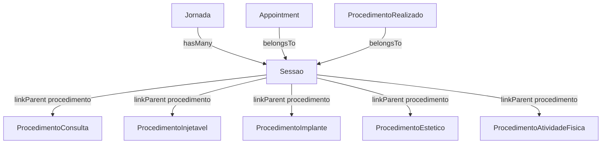

# FeatureClinica Fase 7 - Sessao dynamicLogic

Base path: `components/crm/source/custom/Espo/Modules/FeatureClinica/`

## Scope

Fase 7 adds `dynamicLogic` field visibility conditions to the Sessao entity so that type-specific fields only appear when relevant to the procedure type. This preserves the unified single-panel "Sessoes" UX on Jornada while eliminating confusion from irrelevant empty fields.

## Problem

The single `Sessao` entity has fields like `dosagemAplicada`, `unidadeDosagem`, and `insumoLote` that only apply to certain procedure types (injectables, implants). When viewing a session for a ProcedimentoConsulta or ProcedimentoAtividadeFisica, these fields appear empty and confuse users.

## Decision: Single Entity + dynamicLogic

Two approaches were evaluated:

1. **Polymorphic entities** (SessaoInjetavel, SessaoImplante, etc.) — rejected because it would break the unified "Sessoes" panel on Jornada and require complex multi-entity relationship management.
2. **Single entity + dynamicLogic** (chosen) — keeps the existing Sessao entity unchanged and uses EspoCRM's built-in `dynamicLogic` to conditionally show/hide fields based on `procedimentoType`.

Benefits of the chosen approach:
- No schema changes — same entity, same table, same hooks
- Unified single "Sessoes" panel on Jornada (unchanged UX)
- Type-specific field visibility when editing individual sessions
- Easy extensibility — future type-specific fields follow the same pattern

## Architecture (unchanged)

No entity structure changes. All relationships remain as-is.

## Changes

### 1. clientDefs/Sessao.json — dynamicLogic

Added `dynamicLogic.fields` section with visibility conditions:

| Field             | Visible when procedimentoType =                      |
| ----------------- | ----------------------------------------------------- |
| dosagemAplicada   | ProcedimentoInjetavel                                 |
| unidadeDosagem    | ProcedimentoInjetavel                                 |
| insumoLote        | ProcedimentoInjetavel OR ProcedimentoImplante         |

Result per procedure type:
- **ProcedimentoConsulta**: Only shared fields (sequencia, status, procedimento, unidade, etc.)
- **ProcedimentoInjetavel**: Shared + dosagemAplicada, unidadeDosagem, insumoLote
- **ProcedimentoImplante**: Shared + insumoLote
- **ProcedimentoEstetico**: Only shared fields
- **ProcedimentoAtividadeFisica**: Only shared fields

### 2. clientDefs/Sessao.json — procedimentoType filter

Added `procedimentoType` to the `filterList` array so users can filter sessions by procedure type in list views and relationship panels.

## Files Modified

| File                                        | Change                                                 |
| ------------------------------------------- | ------------------------------------------------------ |
| `Resources/metadata/clientDefs/Sessao.json` | Add `dynamicLogic` section + `procedimentoType` filter |
| `.scopes/v3.fase-7.md`                      | New scope document (this file)                         |

**Total: 1 file modified, 1 file created.**

## No Hook Changes Needed

Existing hooks already handle type-specific logic correctly:
- `SnapshotDosagem` only copies dosage when the field is set on the Sessao
- `UpdateSessaoStatus` works regardless of procedure type
- `GenerateSessoesFromPrograma` and `ApproveGenerateJornada` set procedimentoType/Id from source items

## Future Extensibility

To add new type-specific fields for other procedure types:

1. Add field to `entityDefs/Sessao.json`
2. Add `dynamicLogic` visibility condition in `clientDefs/Sessao.json`
3. Add i18n translations
4. (Optional) Add hook logic that checks `procedimentoType`

Example future additions:
- `equipamentoUtilizado` (varchar) — visible when ProcedimentoEstetico
- `nivelIntensidade` (enum) — visible when ProcedimentoAtividadeFisica
- `ehRetorno` (bool) — visible when ProcedimentoConsulta
