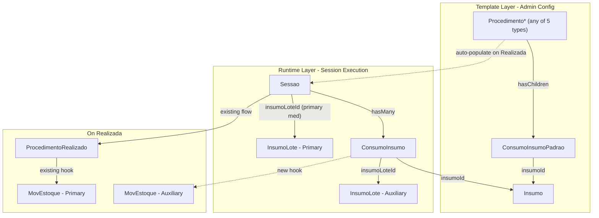

# FeatureClinica Fase 8 - Auxiliary Consumables Tracking

Base path: `components/crm/source/custom/Espo/Modules/FeatureClinica/`

## Scope

Fase 8 adds auxiliary consumables tracking: a template entity (`ConsumoInsumoPadrao`) on all 5 Procedimento types to define which supplies a procedure typically requires, and a runtime entity (`ConsumoInsumo`) on Sessao to record actual consumption with specific lots. On realization, templates auto-populate with FIFO lot selection, stock is validated, and MovimentacaoEstoque records are created for each consumed item.

## Architecture



## Patterns to Follow

- **Child entity**: Follow [OrcamentoItem.json](components/crm/source/custom/Espo/Modules/FeatureClinica/Resources/metadata/entityDefs/OrcamentoItem.json) for linkParent child entity pattern
- **hasChildren**: Follow existing `prescricaoItens`, `orcamentoItens` links on Procedimento types
- **AfterSave hooks**: Follow [CreateProcedimentoRealizadoOnRealizada.php](components/crm/source/custom/Espo/Modules/FeatureClinica/Hooks/Sessao/CreateProcedimentoRealizadoOnRealizada.php) pattern
- **BeforeSave validation**: Follow [ValidateEstoqueOnRealizada.php](components/crm/source/custom/Espo/Modules/FeatureClinica/Hooks/Sessao/ValidateEstoqueOnRealizada.php) pattern

---

## Step 1: ConsumoInsumoPadrao Entity (10 new files)

**entityDefs/ConsumoInsumoPadrao.json** -- Default consumables template:

- `procedimentoType` (varchar, maxLength: 100)
- `procedimentoId` (foreignId)
- `procedimento` (linkParent, entityList: ["ProcedimentoConsulta", "ProcedimentoInjetavel", "ProcedimentoImplante", "ProcedimentoEstetico", "ProcedimentoAtividadeFisica"])
- `insumo` (link, required) -- FK to Insumo (supply type)
- `quantidade` (float, required, default: 1) -- default quantity per session
- `observacao` (varchar, maxLength: 255, trim: true)
- Standard fields: createdAt, modifiedAt, createdBy, modifiedBy, teams
- Links: procedimento (belongsToParent), insumo (belongsTo Insumo, foreignName: nome)
- Indexes: procedimento composite, insumoId
- Collection: orderBy: createdAt, asc

**scopes/ConsumoInsumoPadrao.json**: entity: true, tab: false, stream: false, hasTeams: true, module: "FeatureClinica", type: "Base"

**clientDefs/ConsumoInsumoPadrao.json**: controller: "controllers/record", iconClass: "fas fa-clipboard-list"

**aclDefs/ConsumoInsumoPadrao.json**: create: "admin", read: "team", edit: "admin", delete: "admin"

**layouts**: detail.json (procedimento, insumo, quantidade, observacao), list.json (insumo, quantidade, observacao), listSmall.json (insumo, quantidade)

**i18n**: pt_BR (Consumo Padrão / Consumos Padrão), en_US (Default Consumable / Default Consumables)

**Controllers/ConsumoInsumoPadrao.php**: extends Base

---

## Step 2: ConsumoInsumo Entity (10 new files)

**entityDefs/ConsumoInsumo.json** -- Actual consumption line item:

- `sessao` (link, required) -- FK to Sessao
- `insumo` (link) -- FK to Insumo (pre-filled from template)
- `insumoLote` (link, required) -- FK to InsumoLote (the actual consumed lot)
- `quantidade` (float, required, default: 1) -- quantity consumed
- `observacao` (varchar, maxLength: 255, trim: true)
- Standard fields: createdAt, modifiedAt, createdBy, modifiedBy, teams
- Links: sessao (belongsTo Sessao, foreign: consumoItens), insumo (belongsTo Insumo, foreignName: nome), insumoLote (belongsTo InsumoLote, foreignName: numeroLote)
- Indexes: sessaoId, insumoId, insumoLoteId
- Collection: orderBy: createdAt, asc

**scopes/ConsumoInsumo.json**: entity: true, tab: false, stream: false, hasTeams: true, module: "FeatureClinica", type: "Base"

**clientDefs/ConsumoInsumo.json**: controller: "controllers/record", iconClass: "fas fa-syringe"

**aclDefs/ConsumoInsumo.json**: create: "yes", read: "team", edit: "team", delete: "own"

**layouts**: detail.json (sessao, insumo, insumoLote, quantidade, observacao), list.json (insumo, insumoLote, quantidade, observacao), listSmall.json (insumo, insumoLote, quantidade)

**i18n**: pt_BR (Consumo de Insumo / Consumos de Insumo), en_US (Supply Consumption / Supply Consumptions)

**Controllers/ConsumoInsumo.php**: extends Base

---

## Step 3: Edit Existing Entities (15 edits across 5 Procedimento types)

### All 5 Procedimento Types -- add hasChildren link

Add to entityDefs links:

```json
"consumoInsumoPadrao": {
    "type": "hasChildren",
    "entity": "ConsumoInsumoPadrao",
    "foreign": "procedimento"
}
```

Add `"consumoInsumoPadrao"` to each relationships.json layout.

Add to each clientDefs relationshipPanels:

```json
"consumoInsumoPadrao": {
    "create": true,
    "select": false
}
```

---

## Step 4: Edit Sessao, InsumoLote, Insumo, MovimentacaoEstoque

### Sessao (entityDefs)

Add link: `consumoItens` (hasMany ConsumoInsumo, foreign: sessao)

### Sessao (relationships layout)

Add `"consumoItens"` to relationships.json.

### Sessao (clientDefs)

Add relationshipPanels config for consumoItens: create: true, select: false.

### InsumoLote (entityDefs)

Add link: `consumoItens` (hasMany ConsumoInsumo, foreign: insumoLote)

### Insumo (entityDefs)

Add links: `consumoInsumoPadrao` (hasMany) and `consumoItens` (hasMany).

### MovimentacaoEstoque (entityDefs)

Expand `origem` field entityList to include "Sessao":

```json
"entityList": ["ProcedimentoRealizado", "Sessao"]
```

---

## Step 5: Hooks (4 new files)

### Sessao/AutoPopulateConsumoItensOnRealizada.php (order 4, beforeSave)

When Sessao.status → "Realizada":
1. Load procedure's ConsumoInsumoPadrao templates
2. Load existing ConsumoInsumo on this Sessao
3. For each template not covered by existing ConsumoInsumo (matched by insumoId):
   - Find best lot: InsumoLote WHERE insumoId = template.insumoId AND unidadeId = sessao.unidadeId AND status = 'Disponivel' AND quantidadeAtual >= template.quantidade ORDER BY dataValidade ASC LIMIT 1
   - Store in `_pendingConsumoItens` on entity
   - If no lot found, throw BadRequest

### Sessao/ValidateConsumoItensOnRealizada.php (order 6, beforeSave)

When Sessao.status → "Realizada":
1. Load existing ConsumoInsumo + read `_pendingConsumoItens`
2. For each item, validate InsumoLote.quantidadeAtual >= quantidade
3. Throw BadRequest if insufficient stock

### Sessao/CreateConsumoItensAndMovimentacoes.php (order 12, afterSave)

When Sessao.status → "Realizada":
1. Create ConsumoInsumo records from `_pendingConsumoItens`
2. Load ALL ConsumoInsumo on this Sessao
3. For each, create MovimentacaoEstoque (tipo=Saida, origemType=Sessao)

### ConsumoInsumo/PreventEditAfterRealizada.php (order 1, beforeSave + beforeRemove)

Prevents edit/delete when parent Sessao.status = "Realizada".

---

## Step 6: Infrastructure (SeedRole + i18n)

### SeedRole.php

tenant-base data:
```php
'ConsumoInsumoPadrao' => ['create' => 'no', 'read' => 'team', 'edit' => 'no', 'delete' => 'no'],
'ConsumoInsumo' => ['create' => 'yes', 'read' => 'team', 'edit' => 'team', 'delete' => 'own'],
```

tenant-base fieldData:
```php
'ConsumoInsumoPadrao' => (object)[],
'ConsumoInsumo' => (object)[],
```

tenant-admin data overrides:
```php
'ConsumoInsumoPadrao' => ['create' => 'yes', 'read' => 'team', 'edit' => 'team', 'delete' => 'team'],
'ConsumoInsumo' => ['create' => 'yes', 'read' => 'team', 'edit' => 'team', 'delete' => 'own'],
```

---

## File Count Summary

- ConsumoInsumoPadrao: 10 new files
- ConsumoInsumo: 10 new files
- Hooks: 4 new files
- Edits: ~18 (5 Procedimento entityDefs + 5 relationships + 5 clientDefs, Sessao entityDefs + relationships + clientDefs, InsumoLote entityDefs, Insumo entityDefs, MovimentacaoEstoque entityDefs, SeedRole.php)

**Total: 24 new files + ~18 edits = ~42 file operations**

---

## Critical Notes

- **Backward compatible**: Procedures without templates auto-populate nothing. Existing data unaffected.
- **Primary medication flow untouched**: Sessao.insumoLoteId + dosagemAplicada + existing PR/MovimentacaoEstoque chain unchanged.
- **FIFO lot selection**: Auto-selects earliest-expiry lot at the same unit with sufficient stock.
- **Manual override**: Users can add ConsumoInsumo before realization; auto-populate skips those insumo types.
- **Immutability**: ConsumoInsumo records locked after Sessao is realized.
