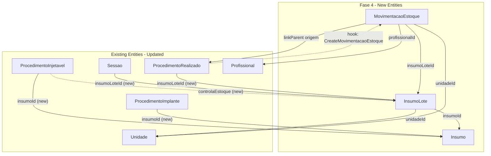

# FeatureClinica Fase 4 - Estoque

Base path: `components/crm/source/custom/Espo/Modules/FeatureClinica/`

## Scope

Fase 4 adds the inventory management layer: Insumo (supply catalog), InsumoLote (lot-tracked stock per unit), and MovimentacaoEstoque (immutable stock movement records). It also fulfills deferred fields from Fase 2 — adding `insumoId`/`controlaEstoque` to ProcedimentoInjetavel/ProcedimentoImplante and `insumoLoteId` to Sessao/ProcedimentoRealizado.

## Architecture



## Patterns to Follow

- **entityDefs**: Follow [Convenio.json](components/crm/source/custom/Espo/Modules/FeatureClinica/Resources/metadata/entityDefs/Convenio.json) (entity with nome, links, indexes)
- **Catalog scopes**: Follow [Unidade scopes](components/crm/source/custom/Espo/Modules/FeatureClinica/Resources/metadata/scopes/Unidade.json) (`tab: false`, `hasTeams: true`)
- **AfterSave hooks**: Follow [CreateAtendimentoOnRealizado.php](components/crm/source/custom/Espo/Modules/FeatureClinica/Hooks/Appointment/CreateAtendimentoOnRealizado.php) pattern
- **linkParent entityList on field**, hasChildren with `"foreign"` — confirmed v3 patterns

---

## Step 1: Insumo Entity (11 new files)

**entityDefs/Insumo.json** -- Supply master catalog:

- `nome` (varchar, required, maxLength: 255, trim: true) -- e.g. Tirzepatida, Ácido Lipoico, Hybrius
- `descricao` (text) -- description
- `tipo` (enum, required) -- options: Medicamento, Cosmetico, Material, Outro
- `unidadeMedida` (enum, required) -- options: mg, ml, UI, unidade, caixa
- `estoqueMinimo` (float) -- minimum stock level for alerts
- `fornecedorPrincipal` (varchar, maxLength: 255, trim: true) -- primary supplier name
- `requerReceituario` (bool, default: false) -- requires special receipt
- `ativo` (bool, default: true)
- Standard fields: createdAt, modifiedAt, createdBy, modifiedBy, teams
- Links: lotes (hasMany InsumoLote, foreign: insumo), procedimentosInjetaveis (hasMany ProcedimentoInjetavel, foreign: insumo), procedimentosImplante (hasMany ProcedimentoImplante, foreign: insumo)
- Indexes: ativo, tipo
- Collection: orderBy: nome, asc; textFilterFields: ["nome", "descricao"]

**scopes/Insumo.json**: entity: true, tab: false, stream: false, hasTeams: true, module: "FeatureClinica", type: "Base"

**clientDefs/Insumo.json**: controller: "controllers/record", iconClass: "fas fa-vials", nameAttribute: "nome", relationshipPanels for lotes (create: true, select: false), procedimentosInjetaveis/procedimentosImplante (create: false, select: false)

**aclDefs/Insumo.json**: create: "admin", read: "team", edit: "admin", delete: "admin", stream: false

**layouts**: detail.json (nome, tipo, unidadeMedida, estoqueMinimo, fornecedorPrincipal, requerReceituario, ativo, descricao), list.json (nome, tipo, unidadeMedida, estoqueMinimo, ativo), detailSmall.json (nome, tipo, ativo), relationships.json (lotes panel, procedimentosInjetaveis panel, procedimentosImplante panel)

**i18n**: pt_BR (Insumo / Insumos), en_US (Supply / Supplies). Field labels: tipo → Tipo / Type, unidadeMedida → Unidade de Medida / Unit of Measure, estoqueMinimo → Estoque Mínimo / Minimum Stock, fornecedorPrincipal → Fornecedor Principal / Primary Supplier, requerReceituario → Requer Receituário / Requires Receipt. Enum tipo: Medicamento → Medicamento/Medication, Cosmetico → Cosmético/Cosmetic, Material → Material, Outro → Outro/Other. Enum unidadeMedida: mg, ml, UI, unidade → unidade/unit, caixa → caixa/box.

**Controllers/Insumo.php**: extends Base

---

## Step 2: InsumoLote Entity (11 new files)

**entityDefs/InsumoLote.json** -- Lot-tracked stock per unit:

- `insumo` (link, required) -- FK to Insumo
- `unidade` (link, required) -- FK to Unidade (which unit holds this lot)
- `numeroLote` (varchar, required, maxLength: 100, trim: true) -- manufacturer lot code
- `dataFabricacao` (date) -- manufacturing date
- `dataValidade` (date, required) -- expiry date
- `quantidadeEntrada` (float, required) -- quantity at intake
- `quantidadeAtual` (float, required) -- current balance (updated by MovimentacaoEstoque)
- `fornecedor` (varchar, maxLength: 255, trim: true) -- supplier for this purchase
- `notaFiscal` (varchar, maxLength: 100, trim: true) -- invoice number
- `precoUnitarioCusto` (currency) -- unit cost for management
- `status` (enum, required) -- options: Disponivel, Vencido, Esgotado, Bloqueado. Default: Disponivel
- Standard fields: createdAt, modifiedAt, createdBy, modifiedBy, teams
- Links: insumo (belongsTo Insumo, foreignName: nome), unidade (belongsTo Unidade, foreignName: nome), movimentacoes (hasMany MovimentacaoEstoque, foreign: insumoLote), sessoes (hasMany Sessao, foreign: insumoLote), procedimentosRealizados (hasMany ProcedimentoRealizado, foreign: insumoLote)
- Indexes: insumoId, unidadeId, status, dataValidade, numeroLote
- Collection: orderBy: dataValidade, asc; textFilterFields: ["numeroLote", "fornecedor"]

**scopes/InsumoLote.json**: entity: true, tab: false, stream: false, hasTeams: true, module: "FeatureClinica", type: "Base"

**clientDefs/InsumoLote.json**: controller: "controllers/record", iconClass: "fas fa-boxes", nameAttribute: "numeroLote", relationshipPanels for movimentacoes (create: false, select: false), filterList with statusFilter

**aclDefs/InsumoLote.json**: create: "admin", read: "team", edit: "admin", delete: "admin", stream: false

**layouts**: detail.json (insumo, unidade, numeroLote, dataFabricacao, dataValidade, quantidadeEntrada, quantidadeAtual, fornecedor, notaFiscal, precoUnitarioCusto, status), list.json (insumo, unidade, numeroLote, dataValidade, quantidadeAtual, status), detailSmall.json (insumo, numeroLote, quantidadeAtual, status), relationships.json (movimentacoes panel)

**i18n**: pt_BR (Lote de Insumo / Lotes de Insumo), en_US (Supply Lot / Supply Lots). Field labels: numeroLote → Número do Lote / Lot Number, dataFabricacao → Data de Fabricação / Manufacturing Date, dataValidade → Data de Validade / Expiry Date, quantidadeEntrada → Quantidade de Entrada / Entry Quantity, quantidadeAtual → Quantidade Atual / Current Quantity, fornecedor → Fornecedor / Supplier, notaFiscal → Nota Fiscal / Invoice, precoUnitarioCusto → Preço Unitário (Custo) / Unit Cost Price, status → Status. Enum status: Disponivel → Disponível/Available, Vencido → Vencido/Expired, Esgotado → Esgotado/Depleted, Bloqueado → Bloqueado/Blocked.

**Controllers/InsumoLote.php**: extends Base

---

## Step 3: MovimentacaoEstoque Entity (10 new files)

**entityDefs/MovimentacaoEstoque.json** -- Immutable stock movement record:

- `insumoLote` (link, required) -- FK to InsumoLote
- `unidade` (link, required) -- FK to Unidade
- `tipo` (enum, required) -- options: Entrada, Saida, Ajuste, Descarte
- `quantidade` (float, required) -- movement quantity (positive)
- `origemType` (varchar, maxLength: 100)
- `origemId` (foreignId)
- `origem` (linkParent) -- entityList: ["ProcedimentoRealizado"]
- `profissional` (link) -- FK to Profissional (who performed the movement)
- `dataHora` (datetime, required) -- movement timestamp
- `observacao` (text) -- reason for adjustment/discard
- Standard fields: createdAt, modifiedAt, createdBy, modifiedBy, teams
- Links: insumoLote (belongsTo InsumoLote, foreignName: numeroLote), unidade (belongsTo Unidade, foreignName: nome), profissional (belongsTo Profissional, foreignName: nome), origem (belongsToParent)
- Indexes: insumoLoteId, unidadeId, tipo, dataHora, origem composite
- Collection: orderBy: dataHora, desc

**NOTE:** The `origem` linkParent entityList currently only includes "ProcedimentoRealizado" (automatic outflow from procedure execution). Manual entries (Compra, Ajuste, Descarte) don't use linkParent — they set origemType/origemId to null and describe the reason in `observacao`. The entityList can be expanded in future fases if dedicated Compra entities are added.

**scopes/MovimentacaoEstoque.json**: entity: true, tab: false, stream: false, hasTeams: true, module: "FeatureClinica", type: "Base"

**clientDefs/MovimentacaoEstoque.json**: controller: "controllers/record", iconClass: "fas fa-exchange-alt", nameAttribute: "id", filterList with tipoFilter

**aclDefs/MovimentacaoEstoque.json**: create: "yes", read: "team", edit: "no", delete: "no", stream: false (immutable records — no edit/delete for audit trail)

**layouts**: detail.json (insumoLote, unidade, tipo, quantidade, profissional, dataHora, origem, observacao), list.json (insumoLote, tipo, quantidade, profissional, dataHora), detailSmall.json (insumoLote, tipo, quantidade)

**i18n**: pt_BR (Movimentação de Estoque / Movimentações de Estoque), en_US (Stock Movement / Stock Movements). Field labels: tipo → Tipo / Type, quantidade → Quantidade / Quantity, dataHora → Data/Hora / Date/Time, origem → Origem / Origin, observacao → Observação / Note. Enum tipo: Entrada → Entrada/Inbound, Saida → Saída/Outbound, Ajuste → Ajuste/Adjustment, Descarte → Descarte/Disposal.

**Controllers/MovimentacaoEstoque.php**: extends Base

---

## Step 4: Hooks (2 new files)

**Hooks/ProcedimentoRealizado/CreateMovimentacaoEstoque.php** (order 11, new style `implements AfterSave`):

- When ProcedimentoRealizado is new (isNew):
  - Load the parent procedure via procedimentoType/procedimentoId
  - If procedimentoType is "ProcedimentoInjetavel" and procedure.controlaEstoque is true, OR procedimentoType is "ProcedimentoImplante":
    - Read `insumoLoteId` from ProcedimentoRealizado (must be set by user)
    - If insumoLoteId is set:
      - Create MovimentacaoEstoque with:
        - insumoLoteId from ProcedimentoRealizado
        - unidadeId from parent Atendimento
        - tipo = "Saida"
        - quantidade = ProcedimentoRealizado.quantidade (default 1)
        - origemType = "ProcedimentoRealizado", origemId = ProcedimentoRealizado.id
        - profissionalId from parent Atendimento
        - dataHora = now
        - teamsIds from ProcedimentoRealizado

**Hooks/MovimentacaoEstoque/UpdateInsumoLoteSaldo.php** (order 1, new style `implements AfterSave`):

- When MovimentacaoEstoque is new (isNew):
  - Load the InsumoLote
  - Recalculate `quantidadeAtual` based on tipo:
    - Entrada: add quantidade
    - Saida/Descarte: subtract quantidade
    - Ajuste: set to quantidade (absolute)
  - Save InsumoLote with new quantidadeAtual
  - If quantidadeAtual <= 0: set InsumoLote.status = "Esgotado"
  - If quantidadeAtual > 0 and status was "Esgotado": set status = "Disponivel"

---

## Step 5: Edit Existing Entities (4 edits for deferred fields)

### ProcedimentoInjetavel — add deferred fields

**[entityDefs/ProcedimentoInjetavel.json](components/crm/source/custom/Espo/Modules/FeatureClinica/Resources/metadata/entityDefs/ProcedimentoInjetavel.json)** -- add fields:

```json
"insumo": {
    "type": "link"
},
"controlaEstoque": {
    "type": "bool",
    "default": false
}
```

Add link:

```json
"insumo": {
    "type": "belongsTo",
    "entity": "Insumo",
    "foreignName": "nome"
}
```

Add index: `"insumoId": {"columns": ["insumoId"]}`

Update layouts to include insumo and controlaEstoque fields.

### ProcedimentoImplante — add deferred field

**[entityDefs/ProcedimentoImplante.json](components/crm/source/custom/Espo/Modules/FeatureClinica/Resources/metadata/entityDefs/ProcedimentoImplante.json)** -- add fields:

```json
"insumo": {
    "type": "link"
}
```

Add link:

```json
"insumo": {
    "type": "belongsTo",
    "entity": "Insumo",
    "foreignName": "nome"
}
```

Add index: `"insumoId": {"columns": ["insumoId"]}`

Update layouts to include insumo field.

### Sessao — add insumoLoteId

**[entityDefs/Sessao.json](components/crm/source/custom/Espo/Modules/FeatureClinica/Resources/metadata/entityDefs/Sessao.json)** -- add field:

```json
"insumoLote": {
    "type": "link"
}
```

Add link:

```json
"insumoLote": {
    "type": "belongsTo",
    "entity": "InsumoLote",
    "foreignName": "numeroLote"
}
```

Add index: `"insumoLoteId": {"columns": ["insumoLoteId"]}`

Update Sessao detail layout to show insumoLote.

### ProcedimentoRealizado — add insumoLoteId

**[entityDefs/ProcedimentoRealizado.json](components/crm/source/custom/Espo/Modules/FeatureClinica/Resources/metadata/entityDefs/ProcedimentoRealizado.json)** -- add field:

```json
"insumoLote": {
    "type": "link"
}
```

Add link:

```json
"insumoLote": {
    "type": "belongsTo",
    "entity": "InsumoLote",
    "foreignName": "numeroLote"
}
```

Add index: `"insumoLoteId": {"columns": ["insumoLoteId"]}`

Update ProcedimentoRealizado detail layout to show insumoLote.

Also add hasChildren link for movimentacoes:

```json
"movimentacoesEstoque": {
    "type": "hasChildren",
    "entity": "MovimentacaoEstoque",
    "foreign": "origem"
}
```

---

## Step 6: Update Infrastructure Files (7 edits)

### Admin Panel

**[adminForUserPanel.json](components/crm/source/custom/Espo/Modules/FeatureClinica/Resources/metadata/app/adminForUserPanel.json)** -- add Estoque section (or entries within clinica):

```json
{
    "url": "#Insumo",
    "label": "Insumos",
    "iconClass": "fas fa-vials",
    "description": "insumos",
    "roles": ["tenant", "tenant-admin"]
},
{
    "url": "#Configurations/InsumoLote",
    "label": "Lotes de Insumo",
    "iconClass": "fas fa-boxes",
    "description": "insumoLotes",
    "roles": ["tenant", "tenant-admin"]
},
{
    "url": "#Configurations/MovimentacaoEstoque",
    "label": "Movimentações de Estoque",
    "iconClass": "fas fa-exchange-alt",
    "description": "movimentacoesEstoque",
    "roles": ["tenant", "tenant-admin"]
}
```

### Configurations i18n

**[i18n/pt_BR/Configurations.json](components/crm/source/custom/Espo/Modules/FeatureClinica/Resources/i18n/pt_BR/Configurations.json)** -- add:

- labels: "Insumos", "Lotes de Insumo", "Movimentações de Estoque"
- descriptions: insumos → "Gerenciar catálogo de insumos e materiais", insumoLotes → "Gerenciar lotes de estoque por unidade", movimentacoesEstoque → "Consultar movimentações de entrada e saída de estoque"
- keywords: appropriate terms

**[i18n/en_US/Configurations.json](components/crm/source/custom/Espo/Modules/FeatureClinica/Resources/i18n/en_US/Configurations.json)** -- equivalent English entries

### SeedSidenavConfig

**[SeedSidenavConfig.php](components/crm/source/custom/Espo/Modules/FeatureClinica/Rebuild/SeedSidenavConfig.php)** -- no changes. Stock entities are admin/catalog entities, not daily operational nav items. InsumoLote is accessed via Insumo detail or admin panel.

### SeedRole

**[SeedRole.php](components/crm/source/custom/Espo/Modules/Global/Rebuild/SeedRole.php)** -- add 3 new entities:

`getTenantBaseConfig().data`:

```php
'Insumo' => ['create' => 'no', 'read' => 'team', 'edit' => 'no', 'delete' => 'no'],
'InsumoLote' => ['create' => 'no', 'read' => 'team', 'edit' => 'no', 'delete' => 'no'],
'MovimentacaoEstoque' => ['create' => 'yes', 'read' => 'team', 'edit' => 'no', 'delete' => 'no'],
```

`getTenantBaseConfig().fieldData`:

```php
'Insumo' => (object)[],
'InsumoLote' => (object)[],
'MovimentacaoEstoque' => (object)[],
```

tenant-admin data overrides:

```php
'Insumo' => ['create' => 'yes', 'read' => 'team', 'edit' => 'team', 'delete' => 'team'],
'InsumoLote' => ['create' => 'yes', 'read' => 'team', 'edit' => 'team', 'delete' => 'team'],
'MovimentacaoEstoque' => ['create' => 'yes', 'read' => 'team', 'edit' => 'no', 'delete' => 'no'],
```

Note: MovimentacaoEstoque is immutable — even tenant-admin cannot edit/delete movements. Only create is allowed.

---

## Scheduled Jobs (deferred to Fase 6)

The following scheduled jobs are specified in the Outdated SPEC but are deferred to Fase 6 (Validacoes Avancadas + Automacoes):

- **InsumoLote expiry alerts** -- daily job that sets `status = "Vencido"` when `dataValidade < today` and creates Task/notification for responsible users
- **Estoque minimo alerts** -- triggered after MovimentacaoEstoque or via daily job, creates alert when `InsumoLote.quantidadeAtual < Insumo.estoqueMinimo`

These are mentioned here for completeness but will be implemented in v3.fase-6.md.

---

## Critical Notes

- **InsumoLote.quantidadeAtual** is always derived from MovimentacaoEstoque records. The UpdateInsumoLoteSaldo hook maintains this, but the field is also manually settable for initial setup (quantidadeEntrada = quantidadeAtual at creation).
- **MovimentacaoEstoque is immutable** — aclDefs set edit: "no", delete: "no". Corrections are made via Ajuste-type movements, never by editing existing records.
- **origem linkParent** on MovimentacaoEstoque currently only lists "ProcedimentoRealizado". Manual movements (Entrada, Ajuste, Descarte) leave origem null and explain via observacao.
- **controlaEstoque on ProcedimentoInjetavel** gates whether the CreateMovimentacaoEstoque hook fires. ProcedimentoImplante always consumes stock (no gate flag).
- **i18n for deferred fields** — ProcedimentoInjetavel and ProcedimentoImplante i18n files need updates for insumo/controlaEstoque labels.

---

## File Count Summary

- Insumo: 11 new files (entityDefs, scopes, clientDefs, aclDefs, 4 layouts, 2 i18n, Controller)
- InsumoLote: 11 new files
- MovimentacaoEstoque: 10 new files (no relationships layout)
- Hooks: 2 new files
- Edits: ~11 (ProcedimentoInjetavel entityDefs + layouts + i18n, ProcedimentoImplante entityDefs + layouts + i18n, Sessao entityDefs + layout, ProcedimentoRealizado entityDefs + layout, SeedRole, adminForUserPanel, 2 Configurations i18n)

**Total: 34 new files + ~11 edits = ~45 file operations**
