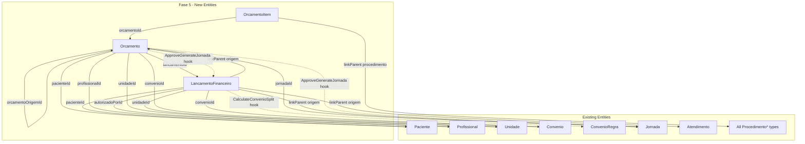

# FeatureClinica Fase 5 - Financeiro

Base path: `components/crm/source/custom/Espo/Modules/FeatureClinica/`

## Scope

Fase 5 adds the financial layer: Orcamento (budget/quote with versioning and approval lifecycle), OrcamentoItem (line items with procedure linkParent), and LancamentoFinanceiro (financial transactions with convênio split calculation). The key workflow is: approved Orcamento auto-generates Jornada + LancamentoFinanceiro.

## Architecture



## Lifecycle Flows

### Orcamento Status Lifecycle

```
Rascunho (Draft)
  └─→ Enviado (Sent to patient)
        ├─→ Aprovado (Approved)
        │     └─→ Jornada auto-generated (with Sessoes from OrcamentoItems)
        │     └─→ LancamentoFinanceiro auto-generated (status: Pendente)
        ├─→ Recusado (Refused — motivoRecusa required)
        └─→ Expirado (Expired — scheduled job when dataValidade < today)
```

### New Version Flow

```
Orcamento v1 (Enviado)
  └─→ Patient requests revision
        └─→ New Orcamento v2 created (versao: 2, orcamentoOrigemId: v1.id)
              └─→ v1 automatically set to Recusado
```

## Patterns to Follow

- **entityDefs**: Follow [Jornada.json](components/crm/source/custom/Espo/Modules/FeatureClinica/Resources/metadata/entityDefs/Jornada.json) (operational entity with multiple links, stream: true)
- **CascadeTeams hook**: Follow [CascadeTeamsFromJornada.php](components/crm/source/custom/Espo/Modules/FeatureClinica/Hooks/Sessao/CascadeTeamsFromJornada.php) (old style, order 1)
- **Validation hooks**: Follow [ValidateCRM.php](components/crm/source/custom/Espo/Modules/FeatureClinica/Hooks/Profissional/ValidateCRM.php) (new style, `implements BeforeSave`)
- **AfterSave workflow hooks**: Follow [CreateAtendimentoOnRealizado.php](components/crm/source/custom/Espo/Modules/FeatureClinica/Hooks/Appointment/CreateAtendimentoOnRealizado.php)

---

## Step 1: Orcamento Entity (11 new files)

**entityDefs/Orcamento.json** -- Budget/Quote:

- `paciente` (link, required) -- FK to Paciente
- `profissional` (link) -- FK to Profissional (who elaborated)
- `unidade` (link, required) -- FK to Unidade
- `convenio` (link) -- FK to Convenio (optional)
- `numero` (varchar, required, maxLength: 20, trim: true) -- sequential number
- `versao` (int, required, default: 1) -- revision version
- `orcamentoOrigem` (link) -- FK to previous Orcamento version (self-referential)
- `status` (enum, required) -- options: Rascunho, Enviado, Aprovado, Expirado, Recusado. Default: Rascunho
- `dataEmissao` (date, required) -- issue date
- `dataValidade` (date, required) -- price guarantee deadline
- `valorTotal` (currency, required) -- sum of items
- `valorDesconto` (currency) -- discount amount
- `valorLiquido` (currency, required) -- valorTotal - valorDesconto
- `autorizadoPor` (link) -- FK to Profissional (who authorized discount)
- `observacoes` (text) -- commercial conditions
- `motivoRecusa` (text) -- required when Recusado
- `jornada` (link) -- FK to Jornada (filled when approved)
- `lancamento` (link) -- FK to LancamentoFinanceiro (filled when approved)
- Standard fields: createdAt, modifiedAt, createdBy, modifiedBy, teams
- Links: paciente (belongsTo Paciente), profissional (belongsTo Profissional, foreignName: nome), unidade (belongsTo Unidade, foreignName: nome), convenio (belongsTo Convenio, foreignName: nome), orcamentoOrigem (belongsTo Orcamento), autorizadoPor (belongsTo Profissional, foreignName: nome), jornada (belongsTo Jornada), lancamento (belongsTo LancamentoFinanceiro), itens (hasMany OrcamentoItem, foreign: orcamento, cascadeDelete: true), versoes (hasMany Orcamento, foreign: orcamentoOrigem)
- Indexes: pacienteId, unidadeId, convenioId, status, dataValidade, numero
- Collection: orderBy: createdAt, desc; textFilterFields: ["numero"]

**scopes/Orcamento.json**: entity: true, tab: true, stream: true, hasTeams: true, module: "FeatureClinica", type: "Base"

**clientDefs/Orcamento.json**: controller: "controllers/record", iconClass: "fas fa-file-invoice-dollar", nameAttribute: "numero", relationshipPanels for itens (create: true, select: false), filterList with statusFilter

**aclDefs/Orcamento.json**: create: "yes", read: "team", edit: "team", delete: "own", stream: "team"

**layouts**: detail.json (paciente, profissional, unidade, convenio, numero, versao, status, dataEmissao, dataValidade, valorTotal, valorDesconto, valorLiquido, autorizadoPor, orcamentoOrigem, jornada, lancamento, observacoes, motivoRecusa), list.json (paciente, numero, versao, status, dataEmissao, dataValidade, valorLiquido), detailSmall.json (paciente, numero, status, valorLiquido), relationships.json (itens panel, versoes panel)

**i18n**: pt_BR (Orçamento / Orçamentos), en_US (Quote / Quotes). Field labels: numero → Número / Number, versao → Versão / Version, orcamentoOrigem → Orçamento Anterior / Previous Quote, status → Status, dataEmissao → Data de Emissão / Issue Date, dataValidade → Data de Validade / Expiry Date, valorTotal → Valor Total / Total Value, valorDesconto → Valor Desconto / Discount Value, valorLiquido → Valor Líquido / Net Value, autorizadoPor → Autorizado Por / Authorized By, observacoes → Observações / Notes, motivoRecusa → Motivo da Recusa / Refusal Reason. Enum status: Rascunho → Rascunho/Draft, Enviado → Enviado/Sent, Aprovado → Aprovado/Approved, Expirado → Expirado/Expired, Recusado → Recusado/Refused.

**Controllers/Orcamento.php**: extends Base

---

## Step 2: OrcamentoItem Entity (10 new files)

**entityDefs/OrcamentoItem.json** -- Quote line item:

- `orcamento` (link, required) -- FK to Orcamento
- `procedimentoType` (varchar, maxLength: 100)
- `procedimentoId` (foreignId)
- `procedimento` (linkParent) -- entityList: all 5 procedure types
- `quantidade` (int, required) -- quantity
- `valorUnitario` (currency, required) -- snapshot from TabelaDePrecos at time of creation
- `valorTotal` (currency, required) -- quantidade × valorUnitario
- `desconto` (float) -- discount percentage on this item
- `valorComDesconto` (currency) -- final item value after discount
- `observacao` (varchar, maxLength: 255, trim: true) -- item-specific note
- Standard fields: createdAt, modifiedAt, createdBy, modifiedBy, teams
- Links: orcamento (belongsTo Orcamento), procedimento (belongsToParent)
- Indexes: orcamentoId, procedimento composite
- Collection: orderBy: createdAt, asc

**scopes/OrcamentoItem.json**: entity: true, tab: false, stream: false, hasTeams: true, module: "FeatureClinica", type: "Base"

**clientDefs/OrcamentoItem.json**: controller: "controllers/record", iconClass: "fas fa-receipt", nameAttribute: "id"

**aclDefs/OrcamentoItem.json**: create: "yes", read: "team", edit: "team", delete: "own", stream: false

**layouts**: detail.json (orcamento, procedimento, quantidade, valorUnitario, valorTotal, desconto, valorComDesconto, observacao), list.json (procedimento, quantidade, valorUnitario, valorTotal, valorComDesconto), detailSmall.json (procedimento, quantidade, valorComDesconto)

**i18n**: pt_BR (Item de Orçamento / Itens de Orçamento), en_US (Quote Item / Quote Items). Field labels: quantidade → Quantidade / Quantity, valorUnitario → Valor Unitário / Unit Price, valorTotal → Valor Total / Total Value, desconto → Desconto (%) / Discount (%), valorComDesconto → Valor com Desconto / Discounted Value, observacao → Observação / Note.

**Controllers/OrcamentoItem.php**: extends Base

---

## Step 3: LancamentoFinanceiro Entity (10 new files)

**entityDefs/LancamentoFinanceiro.json** -- Financial transaction:

- `paciente` (link, required) -- FK to Paciente
- `unidade` (link, required) -- FK to Unidade
- `convenio` (link) -- FK to Convenio (optional)
- `origemType` (varchar, maxLength: 100)
- `origemId` (foreignId)
- `origem` (linkParent) -- entityList: ["Atendimento", "Jornada", "Orcamento"]
- `tipo` (enum, required) -- options: Receita, Estorno, Desconto, Bonus
- `valorTotal` (currency, required)
- `valorDesconto` (currency)
- `valorLiquido` (currency, required) -- valorTotal - valorDesconto
- `percentualConvenio` (float) -- % covered by health plan
- `valorConvenio` (currency) -- health plan portion
- `valorPaciente` (currency) -- patient portion
- `formaPagamento` (enum, required) -- options: Pix, Cartao, Dinheiro, Convenio, Boleto
- `parcelas` (int) -- installments
- `status` (enum, required) -- options: Pendente, Pago, Vencido, Estornado. Default: Pendente
- `dataVencimento` (date, required) -- due date
- `dataPagamento` (date) -- payment date
- `autorizadoPor` (link) -- FK to Profissional (who authorized discount)
- `observacao` (text) -- e.g. "Desconto concedido pelo Dr Bruno"
- Standard fields: createdAt, modifiedAt, createdBy, modifiedBy, teams
- Links: paciente (belongsTo Paciente), unidade (belongsTo Unidade, foreignName: nome), convenio (belongsTo Convenio, foreignName: nome), origem (belongsToParent), autorizadoPor (belongsTo Profissional, foreignName: nome)
- Indexes: pacienteId, unidadeId, convenioId, origem composite, tipo, status, dataVencimento, dataPagamento
- Collection: orderBy: createdAt, desc; textFilterFields: []

**scopes/LancamentoFinanceiro.json**: entity: true, tab: true, stream: true, hasTeams: true, module: "FeatureClinica", type: "Base"

**clientDefs/LancamentoFinanceiro.json**: controller: "controllers/record", iconClass: "fas fa-money-check-alt", nameAttribute: "id", filterList with statusFilter and tipoFilter

**aclDefs/LancamentoFinanceiro.json**: create: "yes", read: "team", edit: "team", delete: "own", stream: "team"

**layouts**: detail.json (paciente, unidade, convenio, origem, tipo, valorTotal, valorDesconto, valorLiquido, percentualConvenio, valorConvenio, valorPaciente, formaPagamento, parcelas, status, dataVencimento, dataPagamento, autorizadoPor, observacao), list.json (paciente, origem, tipo, valorLiquido, formaPagamento, status, dataVencimento), detailSmall.json (paciente, tipo, valorLiquido, status)

**i18n**: pt_BR (Lançamento Financeiro / Lançamentos Financeiros), en_US (Financial Transaction / Financial Transactions). Field labels: origem → Origem / Origin, tipo → Tipo / Type, valorTotal → Valor Total / Total Value, valorDesconto → Valor Desconto / Discount Value, valorLiquido → Valor Líquido / Net Value, percentualConvenio → Percentual Convênio / Health Plan %, valorConvenio → Valor Convênio / Health Plan Value, valorPaciente → Valor Paciente / Patient Value, formaPagamento → Forma de Pagamento / Payment Method, parcelas → Parcelas / Installments, status → Status, dataVencimento → Data de Vencimento / Due Date, dataPagamento → Data de Pagamento / Payment Date, autorizadoPor → Autorizado Por / Authorized By, observacao → Observação / Note. Enum tipo: Receita → Receita/Revenue, Estorno → Estorno/Refund, Desconto → Desconto/Discount, Bonus → Bônus/Bonus. Enum formaPagamento: Pix, Cartao → Cartão/Card, Dinheiro → Dinheiro/Cash, Convenio → Convênio/Health Plan, Boleto → Boleto/Bank Slip. Enum status: Pendente → Pendente/Pending, Pago → Pago/Paid, Vencido → Vencido/Overdue, Estornado → Estornado/Refunded.

**Controllers/LancamentoFinanceiro.php**: extends Base

---

## Step 4: Hooks (4 new files)

**Hooks/OrcamentoItem/CascadeTeamsFromOrcamento.php** (order 1, old style beforeSave):

- Copies `teamsIds` from parent Orcamento to OrcamentoItem on create/update
- Follows exact pattern of [CascadeTeamsFromJornada.php](components/crm/source/custom/Espo/Modules/FeatureClinica/Hooks/Sessao/CascadeTeamsFromJornada.php)

**Hooks/Orcamento/ApproveGenerateJornada.php** (order 9, new style `implements BeforeSave`):

- Triggers when status changes TO "Aprovado" (check `isAttributeChanged('status')` and new value is "Aprovado"):
  1. Load OrcamentoItems
  2. Create Jornada:
     - pacienteId from Orcamento
     - unidadeId from Orcamento
     - convenioId from Orcamento
     - nome = "Orçamento #" + Orcamento.numero
     - dataInicio = today
     - status = "EmAndamento"
     - teamsIds from Orcamento
  3. For each OrcamentoItem, create Sessao in the new Jornada:
     - jornadaId = new Jornada.id
     - procedimentoType/procedimentoId from OrcamentoItem
     - sequencia = item order
     - status = "Disponivel"
     - quantidade times (create N sessoes for quantidade > 1)
     - unidadeId from Orcamento
     - teamsIds from Orcamento
  4. Create LancamentoFinanceiro:
     - pacienteId from Orcamento
     - unidadeId from Orcamento
     - convenioId from Orcamento
     - origemType = "Orcamento", origemId = Orcamento.id
     - tipo = "Receita"
     - valorTotal = Orcamento.valorTotal
     - valorDesconto = Orcamento.valorDesconto
     - valorLiquido = Orcamento.valorLiquido
     - status = "Pendente"
     - dataVencimento = today (or configurable)
     - autorizadoPorId from Orcamento (if discount)
     - teamsIds from Orcamento
  5. Set Orcamento.jornadaId = new Jornada.id
  6. Set Orcamento.lancamentoId = new LancamentoFinanceiro.id

**Hooks/LancamentoFinanceiro/ValidateAutorizacao.php** (order 9, new style `implements BeforeSave`):

- When entity is new or `valorDesconto` changed:
  - If valorDesconto > 0 and autorizadoPorId is null:
    - Throw BadRequest: "Desconto requer autorização. Informe o profissional que autorizou o desconto."

**Hooks/LancamentoFinanceiro/CalculateConvenioSplit.php** (order 10, new style `implements BeforeSave`):

- When entity is new or convenioId changed or valorLiquido changed:
  - If convenioId is set:
    - Load origem via linkParent to determine the procedure
    - Query ConvenioRegra matching convenioId + procedure (via origem → OrcamentoItems or direct)
    - If ConvenioRegra found and cobertura != "NaoCoberto":
      - If cobertura == "Total": percentualConvenio = 100
      - If cobertura == "Parcial": percentualConvenio = ConvenioRegra.percentualCobertura
      - Calculate: valorConvenio = valorLiquido × (percentualConvenio / 100)
      - If ConvenioRegra.valorFixo is set: valorConvenio = min(valorConvenio, ConvenioRegra.valorFixo)
      - valorPaciente = valorLiquido - valorConvenio
    - If no ConvenioRegra or NaoCoberto:
      - percentualConvenio = 0, valorConvenio = 0, valorPaciente = valorLiquido

---

## Step 5: Update Existing Files (10+ edits)

### Existing Entity Links

**[entityDefs/Paciente.json](components/crm/source/custom/Espo/Modules/FeatureClinica/Resources/metadata/entityDefs/Paciente.json)** -- add links:

```json
"orcamentos": {
    "type": "hasMany",
    "entity": "Orcamento",
    "foreign": "paciente"
},
"lancamentosFinanceiros": {
    "type": "hasMany",
    "entity": "LancamentoFinanceiro",
    "foreign": "paciente"
}
```

Update Paciente relationships layout.

**[entityDefs/Jornada.json](components/crm/source/custom/Espo/Modules/FeatureClinica/Resources/metadata/entityDefs/Jornada.json)** -- add hasChildren link:

```json
"lancamentosFinanceiros": {
    "type": "hasChildren",
    "entity": "LancamentoFinanceiro",
    "foreign": "origem"
},
"orcamentos": {
    "type": "hasMany",
    "entity": "Orcamento",
    "foreign": "jornada"
}
```

**[entityDefs/Atendimento.json](components/crm/source/custom/Espo/Modules/FeatureClinica/Resources/metadata/entityDefs/Atendimento.json)** -- add hasChildren link:

```json
"lancamentosFinanceiros": {
    "type": "hasChildren",
    "entity": "LancamentoFinanceiro",
    "foreign": "origem"
}
```

### All Procedure Types — add hasChildren for OrcamentoItem

**[entityDefs/ProcedimentoConsulta.json](components/crm/source/custom/Espo/Modules/FeatureClinica/Resources/metadata/entityDefs/ProcedimentoConsulta.json)** and all 4 other procedure entityDefs:

```json
"orcamentoItens": {
    "type": "hasChildren",
    "entity": "OrcamentoItem",
    "foreign": "procedimento"
}
```

### Update procedureTypes.json

**[procedureTypes.json](components/crm/source/custom/Espo/Modules/FeatureClinica/Resources/metadata/app/procedureTypes.json)** -- add OrcamentoItem to consumingEntities:

```json
"consumingEntities": ["Sessao", "Appointment", "ProcedimentoRealizado", "TabelaDePrecos", "ConvenioRegra", "ProgramaItem", "PrescricaoItem", "OrcamentoItem"]
```

### Admin Panel

**[adminForUserPanel.json](components/crm/source/custom/Espo/Modules/FeatureClinica/Resources/metadata/app/adminForUserPanel.json)** -- add financial entries:

```json
{
    "url": "#Orcamento",
    "label": "Orçamentos",
    "iconClass": "fas fa-file-invoice-dollar",
    "description": "orcamentos",
    "roles": ["tenant", "tenant-admin"]
},
{
    "url": "#LancamentoFinanceiro",
    "label": "Lançamentos Financeiros",
    "iconClass": "fas fa-money-check-alt",
    "description": "lancamentosFinanceiros",
    "roles": ["tenant", "tenant-admin"]
}
```

### Configurations i18n

**[i18n/pt_BR/Configurations.json](components/crm/source/custom/Espo/Modules/FeatureClinica/Resources/i18n/pt_BR/Configurations.json)** -- add:

- labels: "Orçamentos", "Lançamentos Financeiros"
- descriptions: orcamentos → "Gerenciar orçamentos e propostas comerciais", lancamentosFinanceiros → "Gerenciar lançamentos financeiros e cobranças"
- keywords: appropriate terms

**[i18n/en_US/Configurations.json](components/crm/source/custom/Espo/Modules/FeatureClinica/Resources/i18n/en_US/Configurations.json)** -- equivalent English entries

### SeedSidenavConfig

**[SeedSidenavConfig.php](components/crm/source/custom/Espo/Modules/FeatureClinica/Rebuild/SeedSidenavConfig.php)** -- add Orcamento and LancamentoFinanceiro to "Clínica" divider tabList:

```php
'Paciente',
'Atendimento',
'Jornada',
'Prontuario',
'Orcamento',
'LancamentoFinanceiro',
```

### SeedRole

**[SeedRole.php](components/crm/source/custom/Espo/Modules/Global/Rebuild/SeedRole.php)** -- add 3 new entities:

`getTenantBaseConfig().data`:

```php
'Orcamento' => ['create' => 'yes', 'read' => 'team', 'edit' => 'team', 'delete' => 'own', 'stream' => 'team'],
'OrcamentoItem' => ['create' => 'yes', 'read' => 'team', 'edit' => 'team', 'delete' => 'own'],
'LancamentoFinanceiro' => ['create' => 'yes', 'read' => 'team', 'edit' => 'team', 'delete' => 'own', 'stream' => 'team'],
```

`getTenantBaseConfig().fieldData`:

```php
'Orcamento' => (object)[],
'OrcamentoItem' => (object)[],
'LancamentoFinanceiro' => (object)[],
```

tenant-admin data overrides:

```php
'Orcamento' => ['create' => 'yes', 'read' => 'team', 'edit' => 'team', 'delete' => 'team', 'stream' => 'team'],
'OrcamentoItem' => ['create' => 'yes', 'read' => 'team', 'edit' => 'team', 'delete' => 'team'],
'LancamentoFinanceiro' => ['create' => 'yes', 'read' => 'team', 'edit' => 'team', 'delete' => 'team', 'stream' => 'team'],
```

---

## Scheduled Jobs (deferred to Fase 6)

The following scheduled job is specified in the Outdated SPEC but deferred to Fase 6:

- **Orcamento/ExpireScheduledJob** -- daily job that sets `status = "Expirado"` on Orcamentos where `dataValidade < today` and `status = "Enviado"`

---

## Critical Notes

- **Orcamento is a pre-commitment** — no financial obligation exists until approval. This is a key design distinction from the Outdated SPEC's original model where budgets were mixed with financial transactions.
- **Version chain** — Orcamento.orcamentoOrigemId creates a linked list of revisions. The UI should show the version history via the `versoes` hasMany link.
- **ApproveGenerateJornada hook** is complex — it creates both Jornada (with Sessoes) and LancamentoFinanceiro in a single transaction. Error handling must ensure atomicity (if Sessao creation fails, Jornada should be rolled back).
- **LancamentoFinanceiro.origem linkParent** has 3 possible targets: Atendimento (walk-in billing), Jornada (package billing), Orcamento (approved quote billing). The hook determines the source from the creating context.
- **ConvenioRegra split** is calculated at LancamentoFinanceiro save time, not at Orcamento approval. This allows the split to be recalculated if the convenio or coverage rules change.
- **Orcamento tab: true** and **LancamentoFinanceiro tab: true** — these are daily operational entities that users need quick access to, unlike catalog entities which are admin-only.

---

## File Count Summary

- Orcamento: 11 new files (entityDefs, scopes, clientDefs, aclDefs, 4 layouts, 2 i18n, Controller)
- OrcamentoItem: 10 new files
- LancamentoFinanceiro: 10 new files
- Hooks: 4 new files
- Edits: ~14 (Paciente entityDefs + relationships, Jornada entityDefs + relationships, Atendimento entityDefs + relationships, 5 procedure entityDefs, procedureTypes.json, adminForUserPanel.json, SeedSidenavConfig.php, SeedRole.php, 2 Configurations i18n)

**Total: 35 new files + ~14 edits = ~49 file operations**
