# FeatureClinica Fase 6 - Validações Avançadas + Automações

Base path: `components/crm/source/custom/Espo/Modules/FeatureClinica/`

## Scope

Fase 6 is the final fase. It implements all deferred validation hooks, scheduled jobs, and documents the automation/workflow roadmap. Unlike Fases 0-5 which create entities, Fase 6 focuses on cross-cutting concerns: schedule conflict prevention, professional-unit validation, automated status transitions, and alerting.

## Architecture

```mermaid
graph TD
    subgraph hooks [Deferred Hooks]
        ValidateProfUnit[Appointment/ValidateProfessionalUnit]
        CheckConflict[Appointment/CheckScheduleConflict]
    end

    subgraph scheduled [Scheduled Jobs]
        OrcExpire[OrcamentoExpire]
        InsumoExpire[InsumoLoteExpiry]
        PrescExpire[PrescricaoExpiry]
    end

    subgraph workflows [Future Automations]
        ImplantRenew[Implant Renewal Task]
        ReturnConsult[Return Consultation Alert]
        AestheticConfirm[Aesthetic 24h Confirmation]
        JornadaComplete[Jornada Completion Suggestion]
    end

    ValidateProfUnit -->|validates| Appointment
    CheckConflict -->|validates| Appointment
    OrcExpire -->|expires| Orcamento
    InsumoExpire -->|updates| InsumoLote
    PrescExpire -->|expires| Prescricao
    ImplantRenew -->|creates Task from| ProcedimentoRealizado
    ReturnConsult -->|creates Task from| ProcedimentoRealizado
    AestheticConfirm -->|sends notification| Appointment
    JornadaComplete -->|suggests status| Jornada
```



## Patterns to Follow

- **Validation hooks**: Follow [ValidateCRM.php](components/crm/source/custom/Espo/Modules/FeatureClinica/Hooks/Profissional/ValidateCRM.php) (new style, `implements BeforeSave`)
- **Scheduled Jobs**: Follow EspoCRM's `\Espo\Core\Job\Job` interface with `run(Data $data): void`
- **Job registration**: Via `Resources/metadata/app/scheduledJobs.json`
- **Task creation**: Use `EntityManager::createEntity('Task', [...])` for automated task/reminder creation

---

## Step 1: Deferred Appointment Hooks (2 new files)

### Hooks/Appointment/ValidateProfessionalUnit.php

**Purpose:** Validates that the Appointment's profissionalId is active in the Appointment's unidadeId.

- Order: 8 (before CreateAtendimentoOnRealizado at 9)
- Style: new style, `implements BeforeSave`
- Logic:
  1. Skip if status is being set to "Canceled"
  2. If profissionalId or unidadeId is changed (or entity is new):
     - Load Profissional entity
     - Check that Profissional.ativo is true
     - Load Profissional's teams and Unidade's teams
     - Validate that the Profissional shares at least one team with the Unidade (team-based unit membership)
     - If validation fails: throw BadRequest "Profissional não está ativo na unidade selecionada"

**NOTE:** The Outdated SPEC mentions `Profissional.unidades` linkMultiple for unit validation. In v3, this is replaced by team-based scoping — a Profissional "belongs to" a Unidade if they share a team. The hook checks team intersection instead of a direct linkMultiple.

### Hooks/Appointment/CheckScheduleConflict.php

**Purpose:** Validates no time overlap for the same profissional on the same date/time.

- Order: 8 (alongside ValidateProfessionalUnit)
- Style: new style, `implements BeforeSave`
- Logic:
  1. Skip if status is being set to "Canceled" or "NoShow"
  2. If dateStart, dateEnd, or profissionalId is changed (or entity is new):
     - Calculate time window: dateStart to dateEnd (or dateStart + duracaoPrevistaMin if dateEnd not set)
     - Query Appointments where:
       - profissionalId matches
       - id != current entity id (exclude self on edit)
       - status NOT IN ("Canceled", "NoShow")
       - dateStart < currentEnd AND dateEnd > currentStart (overlap condition)
       - deleted = 0
     - If any overlapping appointment found:
       - Throw BadRequest "Conflito de agenda: o profissional já possui agendamento neste horário" with details of the conflicting appointment

---

## Step 2: Scheduled Jobs (3 new files + metadata)

### ScheduledJobs/OrcamentoExpire.php

**Purpose:** Expire Orcamentos past their validity date.

- Runs: daily (recommended: 01:00 AM)
- Logic:
  1. Query Orcamento where status = "Enviado" AND dataValidade < today
  2. For each matching record:
     - Set status = "Expirado"
     - Save entity
     - Log: "Orcamento #{numero} expirado automaticamente"

### ScheduledJobs/InsumoLoteExpiry.php

**Purpose:** Update expired lots and generate alerts for low stock.

- Runs: daily (recommended: 06:00 AM)
- Logic:
  1. **Expiry check:** Query InsumoLote where status = "Disponivel" AND dataValidade < today
     - Set status = "Vencido"
     - Save entity
     - Create Task for notification:
       - name = "Lote vencido: {Insumo.nome} - Lote {numeroLote}"
       - assignedUserId = system or configurable
       - status = "Not Started"
       - dateEnd = today + 3 days
  2. **Near-expiry alert:** Query InsumoLote where status = "Disponivel" AND dataValidade BETWEEN today AND today + 30 days
     - Create Task (if not already created for this lot+month):
       - name = "Lote próximo do vencimento: {Insumo.nome} - Lote {numeroLote} (vence em {dataValidade})"
  3. **Minimum stock alert:** Query InsumoLote grouped by insumoId + unidadeId, SUM(quantidadeAtual) where status = "Disponivel"
     - For each group, load Insumo.estoqueMinimo
     - If total < estoqueMinimo:
       - Create Task (if not already created for this insumo+unidade+month):
         - name = "Estoque baixo: {Insumo.nome} na unidade {Unidade.nome}"

### ScheduledJobs/PrescricaoExpiry.php

**Purpose:** Expire Prescricoes past their validity date.

- Runs: daily (recommended: 01:00 AM)
- Logic:
  1. Query Prescricao where status = "Ativa" AND dataValidade < today
  2. For each matching record:
     - Set status = "Expirada"
     - Save entity
     - Log: "Prescricao #{id} expirada automaticamente"

### Metadata Registration

**Resources/metadata/app/scheduledJobs.json** -- register jobs:

```json
{
    "OrcamentoExpire": {
        "jobClassName": "Espo\\Modules\\FeatureClinica\\ScheduledJobs\\OrcamentoExpire",
        "isSystem": true
    },
    "InsumoLoteExpiry": {
        "jobClassName": "Espo\\Modules\\FeatureClinica\\ScheduledJobs\\InsumoLoteExpiry",
        "isSystem": true
    },
    "PrescricaoExpiry": {
        "jobClassName": "Espo\\Modules\\FeatureClinica\\ScheduledJobs\\PrescricaoExpiry",
        "isSystem": true
    }
}
```

---

## Step 3: Future Automation Specifications (documentation only)

The following automations are documented here as future implementation targets. They can be implemented as hooks, scheduled jobs, or EspoCRM Workflow rules depending on the preferred approach.

### Implant Renewal Task

**Trigger:** After ProcedimentoRealizado saved with procedimentoType = "ProcedimentoImplante"

**Action:**
1. Load ProcedimentoImplante.validadeEstimadaDias
2. Create Task:
   - name = "Renovação de implante: {ProcedimentoImplante.nome} - {Paciente.name}"
   - dateEnd = ProcedimentoRealizado.createdAt + validadeEstimadaDias
   - assignedUserId = Atendimento.profissionalId.userId (if set)
   - description = "Implante aplicado em {date}. Substância: {substanciaAtiva}, dosagem: {dosagemMg}mg"

**Implementation:** Hook on ProcedimentoRealizado (AfterSave) or EspoCRM Workflow rule.

### Return Consultation Alert

**Trigger:** After ProcedimentoRealizado saved with procedimentoType = "ProcedimentoConsulta" AND ProcedimentoConsulta.intervaloRetornoDias is set

**Action:**
1. Load ProcedimentoConsulta.intervaloRetornoDias
2. Create Task:
   - name = "Retorno: {Paciente.name} - {ProcedimentoConsulta.nome}"
   - dateEnd = ProcedimentoRealizado.createdAt + intervaloRetornoDias
   - assignedUserId = Atendimento.profissionalId.userId

**Implementation:** Hook on ProcedimentoRealizado (AfterSave) or EspoCRM Workflow rule.

### Aesthetic 24h Confirmation

**Trigger:** Scheduled job running daily at ~08:00

**Action:**
1. Query Appointments where:
   - procedimentoType = "ProcedimentoEstetico"
   - dateStart BETWEEN tomorrow 00:00 AND tomorrow 23:59
   - status = "Scheduled" or "Confirmed"
2. For each:
   - Create notification or trigger WhatsApp/email confirmation flow (via Chatwoot integration or EspoCRM Signal)

**Implementation:** Scheduled job + Chatwoot integration or EspoCRM notification system.

### Jornada Completion Suggestion

**Trigger:** After Sessao status changes to "Realizada"

**Action:**
1. Load parent Jornada
2. Query all Sessoes for this Jornada
3. If ALL sessoes have status IN ("Realizada", "Cancelada", "Expirada"):
   - If Jornada.status is still "EmAndamento":
     - Create notification to responsible user suggesting Jornada completion
     - OR automatically set Jornada.status = "Concluida" if all non-canceled sessoes are Realizada

**Implementation:** Hook on Sessao (AfterSave). This partially exists as UpdateSessaoStatus hook from Fase 0, but the Jornada-completion logic is new.

### Maximum Sessions Per Week (ProcedimentoEstetico)

**Trigger:** Before Appointment save with procedimentoType = "ProcedimentoEstetico"

**Action:**
1. Load ProcedimentoEstetico.maximoSessoesSemana
2. If set, query Appointments for same pacienteId + same procedimentoId + same week
3. If count >= maximoSessoesSemana: throw BadRequest

**Implementation:** Hook on Appointment (BeforeSave). Could be added to the existing ValidatePrescricao hook or as a separate hook.

### Physical Evaluation Requirement

**Trigger:** Before Appointment save with procedimentoType = "ProcedimentoAtividadeFisica"

**Action:**
1. Load ProcedimentoAtividadeFisica.requerAvaliacaoFisica
2. If true, check if Paciente has a recent Anamnese (within configurable timeframe)
3. If no evaluation found: throw BadRequest

**Implementation:** Hook on Appointment (BeforeSave).

---

## Step 4: Report Specifications (documentation only)

### Faturamento por Unidade

**Purpose:** Revenue report grouped by unit and time period.

**Data source:** LancamentoFinanceiro where status = "Pago"

**Dimensions:**
- unidadeId (group by)
- dataPagamento (period: month/quarter/year)
- tipo (filter: Receita only, or all)

**Metrics:** SUM(valorLiquido), SUM(valorConvenio), SUM(valorPaciente), COUNT(*)

**Implementation:** EspoCRM native Report entity or custom List Report.

### Curva de Dosagem por Jornada

**Purpose:** Track dosage evolution across sessions for injectable procedures (e.g. tirzepatida desmame).

**Data source:** Sessao where jornadaId = X AND procedimentoType = "ProcedimentoInjetavel"

**Dimensions:**
- sequencia (X axis)
- dosagemAplicada (Y axis)
- unidadeDosagemId (label)

**Metrics:** dosagemAplicada per session, trend line

**Implementation:** Custom chart view or EspoCRM Report with chart.

### Dashboard Consolidado

**Purpose:** Executive dashboard for clinic overview.

**Widgets:**
1. Agendamentos do dia (Appointments today, grouped by status)
2. Atendimentos realizados no mês (Atendimentos with status completed, current month)
3. Orcamentos pendentes (Orcamento with status Enviado, count + total value)
4. Estoque baixo (InsumoLote below minimum, alert list)
5. Faturamento do mês (LancamentoFinanceiro Pago this month, SUM valorLiquido)
6. Jornadas em andamento (Jornada with status EmAndamento, count)

**Implementation:** EspoCRM Dashboard with Report panels or custom dashlets.

---

## Step 5: Infrastructure Updates (3 edits)

### rebuild.json

No changes needed — scheduled jobs are registered via `scheduledJobs.json` metadata, not rebuild actions.

### SeedRole

No new entities in Fase 6. No SeedRole changes.

### SeedSidenavConfig

No changes. No new operational entities.

### i18n

**Resources/i18n/pt_BR/ScheduledJob.json** (if not auto-resolved by EspoCRM):

```json
{
    "labels": {
        "OrcamentoExpire": "Expirar Orçamentos Vencidos",
        "InsumoLoteExpiry": "Verificar Vencimento de Lotes",
        "PrescricaoExpiry": "Expirar Prescrições Vencidas"
    }
}
```

**Resources/i18n/en_US/ScheduledJob.json**:

```json
{
    "labels": {
        "OrcamentoExpire": "Expire Overdue Quotes",
        "InsumoLoteExpiry": "Check Lot Expiry & Stock Levels",
        "PrescricaoExpiry": "Expire Overdue Prescriptions"
    }
}
```

---

## Critical Notes

- **ValidateProfessionalUnit uses team intersection**, not a direct Profissional→Unidade link. This is the v3 approach — if a Profissional and a Unidade share at least one Team, the Profissional is considered "active" in that unit. This replaces the Outdated SPEC's `Profissional.unidades` linkMultiple.
- **CheckScheduleConflict** checks only Appointment-to-Appointment overlaps. It does NOT check against Meeting or Call entities. If cross-entity conflict detection is needed, it can be extended later.
- **Scheduled jobs require admin setup** -- after deployment, an admin must create Scheduled Job records in EspoCRM Admin > Scheduled Jobs and set the cron interval for each. The code registers the job classes but does not auto-create the schedule entries.
- **Future automations (Step 3)** are intentionally documented but NOT implemented in Fase 6 files. They represent the next evolution after the core module is stable. Each can be implemented independently as needed.
- **Reports (Step 4)** are also documentation-only. EspoCRM's native Report entity can handle most of these without custom code. The Dashboard widgets may need custom dashlet implementations.

---

## Deferred Items Tracking

### From Fase 0 (now resolved in Fase 6):
- [x] Appointment/ValidateProfessionalUnit.php
- [x] Appointment/CheckScheduleConflict.php

### From Fase 3 (now resolved in Fase 6):
- [x] Confidencial field ACL — documented as future automation (field-level permission)

### From Fase 4 (now resolved in Fase 6):
- [x] InsumoLote expiry scheduled job
- [x] Estoque minimo alerts

### From Fase 5 (now resolved in Fase 6):
- [x] Orcamento expiry scheduled job

---

## File Count Summary

- Hooks: 2 new files (ValidateProfessionalUnit, CheckScheduleConflict)
- Scheduled Jobs: 3 new files (OrcamentoExpire, InsumoLoteExpiry, PrescricaoExpiry)
- Metadata: 1 new file (scheduledJobs.json)
- i18n: 2 new files (ScheduledJob pt_BR + en_US)
- Edits: 0 (no existing file edits required)

**Total: 8 new files + 0 edits = 8 file operations**

(Future automations and reports documented above are NOT counted — they are roadmap items for post-Fase 6 implementation.)
